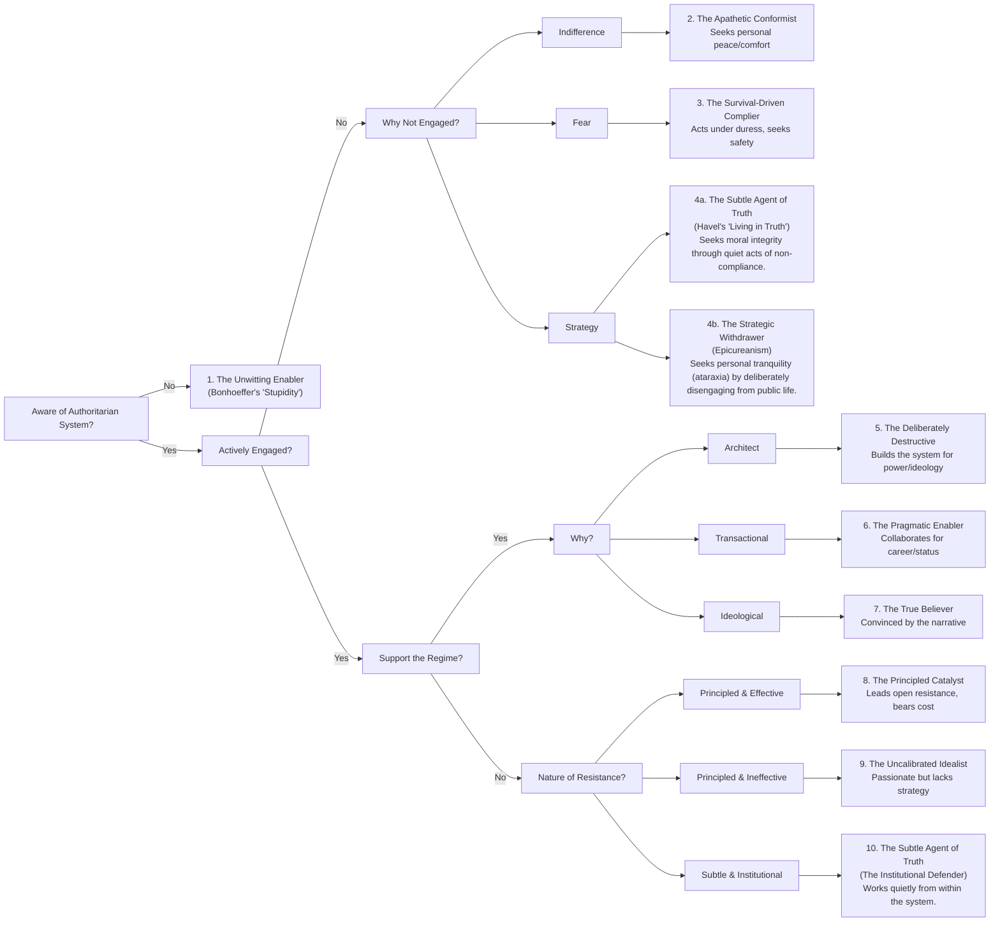

<!-- ARTIFACT HEADER
Type: Structural Scaffold
Status: Working
Obligation Holder: Thomas
Default Mode: Mode 1
Promotion Rule: Promoted to Canonical only after Thomas reviews for accuracy, completeness, and self-audit honesty
Notes: v3.3 (2026-03-24): DB-8 amended (human-AI entanglement via distributed obligation/Sapolsky); BS-9 promoted to DB-26 (aggressively progressive taxation + UBI); BS-7+BS-10 promoted to DB-27 (healthcare as civil right, merged); BS-8 promoted to DB-28 (technology regulation, OpenAI red flag); EV-11 added (Treasury FY2025 fiscal insolvency data); FR-26 enriched (fiscal insolvency application); SA-3 amended (book-writing as resilience calibration); T-13 added (transformation arrival vs. captured political class); all blind spots (BS-7–BS-10) now declared; 34 new edges. Source: Thomas / Claude session 2026-03-24 (Fortune article analysis, fiscal insolvency dog-walk). v3.2 (2026-03-23): Trim pass — removed declared blind spots (BS-1–BS-6), extracted FR-27 to companion file, removed obsolete 7b implies edges, cleaned merger annotations and duplicate edges from edge map. v3.1 (2026-03-23): Structural audit — section renumbering, stale edge cleanup, new blind spots (BS-7–BS-10), SA-7/DB-17 tension edge, FR-2 amended with FR-25 qualification, FP-16 classification note, T-12 expanded, amendment history extracted to changelog file. Full history: `KNOWLEDGE_GRAPH_Thomas__CHANGELOG__20260323.md`.
-->

# KNOWLEDGE GRAPH — Thomas (Self-Side)

**Timestamp:** 2026-03-06 14:00
**Revised:** 2026-03-24 (v3.3)
**Status:** Working / Awaiting Thomas Review
**Version:** 3.3
**Previous version:** `KNOWLEDGE_GRAPH_Thomas__20260323-1700.md` (v3.2)
**Amendment history:** `KNOWLEDGE_GRAPH_Thomas__CHANGELOG__20260323.md`
**Sources:**
- `Mind Map 2025.md`
- `PT$D_book_20260217-1005.md`
- `NARRATIVE_STRUCTURE__20260217-1500.md`
- `PROCESS_Obligation_First_Workflow__20260130-1428.md`
- `_Debating Bad-Faith Tactics_ Socratic Redirections .md`
- Thomas's oral review session, 2026-03-06
- Socratic audit session, 2026-03-13 (Claude — Socratic Debater): authoritarian collapse, cultural sensitivity, friendship calibration, historical resistance models
- Dog-walk session, 2026-03-14 (Claude — dog-walk skill): futility-filter bypass, chain-routing communication strategy, Friend N illustrative case, Switzerland transcript cross-check
- Transcript cross-check: transcripts/Switzerland_Says_NO_to_USA_AHVOeHBF0Qo.md (2026-03-14)
- Thomas's essay on "Do No Harm" vs. "Reduce Suffering" (2026-03-19): harm-avoidance frame critique, ACE Study, liability-driven risk-aversion, domain-general abstraction
- Thomas / Claude conversation, 2026-03-23: functional discourse analysis, capacity failure taxonomy, O'Brien LBC segment (Strait of Hormuz), drapedapes framework
- Thomas / Claude conversation, 2026-03-24: U.S. fiscal insolvency analysis (Fortune article, Hanke & Walker), Treasury FY2025 consolidated financial statements, human-AI entanglement and distributed obligation (Sapolsky), BS-9 promotion to DB-26

**Companion documents required:** `KNOWLEDGE_GRAPH_Interlocutor__[latest].md` (interlocutor graph — build your own)

---

## HOW TO READ THIS DOCUMENT

Nodes are typed and coded for cross-reference:
- **FP-n** — First Principles: strong moral/logical defaults
- **FR-n** — Frameworks: interpretive lenses applied to data
- **DB-n** — Derived Beliefs: positions held because of Principle + Data
- **EV-n** — Evidence/Data: external anchors
- **T-n** — Tension Nodes: genuine or apparent contradictions, with resolution status
- **BS-n** — Blind Spots: domains where principles imply positions not yet declared
- **SA-n** — Self-Audit: calibration challenges; ongoing honest self-assessment

Edges are noted as: `[grounds: FP-x + FR-y]` or `[contradicts: FP-x]`.

**Note on First Principles and contextual application:** All FPs are strong defaults — presumptions that govern in the absence of compelling countervailing reasons, not commands with zero exceptions. The general mechanism is documented in FR-13. "Contextual application" notes in FP nodes retain only principle-specific content; the general logic belongs to FR-13.

---

## SECTION 1 — FIRST PRINCIPLES

*Strong moral and logical defaults. These establish the burden of proof — the baseline from which exceptions must be justified, and where the bar is very high. They are stated universally because principle-form requires universal statement to establish weight. Application is always contextual and requires judgment. See FR-13.*

*First Principles can only be revised via explicit, timestamped amendment with rationale. "Contextual application" is not revision — it is correct use.*

---

### FP-1 — Obligation Precedes Intelligence
No authority without accepting consequence. Intelligence, articulation, and insight do not confer credibility on their own. Credibility is earned by bearing obligation: to consequences, to accuracy, to the reader, to reality — even when costly.

Obligation can be declined or can atrophy through disuse. Atrophy is not the same as refusal — it is a structural incapacity. The project does not assume bad faith; it assumes weakened muscle.

**Source:** Constitution P1

---

### FP-2 — Comfort Is a Suspect Incentive
When comfort conflicts with clarity, calibration, truth-alignment, or accountability — comfort yields. Psychological soothing is not an intrinsic good. The substitution of emotional relief for structural understanding is a failure mode, not a coping strategy.

**Source:** Constitution P3

---

### FP-3 — Argue to Understand, Not to Win
The goal of argument is mutual understanding and truth-proximity, not victory. Winning through rhetoric while the underlying reality remains unexamined is a failure dressed as success.

**Conditional application:** Applies to *good-faith* interlocutors. Against bad-faith actors, the goal shifts to structural defense — protecting the argument space from being colonized by noise. See DB-15 and FR-13.

**Source:** Mind Map §3

---

### FP-4 — Everyone on the Bell Curve Deserves Basic Respect
Regardless of intelligence, mental health, or belief, every person deserves baseline dignity. It is a floor — not a ceiling.

**Contextual application:** Respect is not: agreement, relationship, patience without limit, or validation of false premises. Drawing a relational boundary, withholding engagement, or naming harmful behavior are all compatible with this principle. Respect ≠ engagement. See T-2 and FR-13.

**Source:** Mind Map §3

---

### FP-5 — If You Can Prevent Harm Without Moral Sacrifice, You Must
*From Peter Singer (1972):* "If it is in our power to prevent something very bad from happening, without thereby sacrificing anything of moral significance, we must morally do it."

This converts charity into obligation. The pond is the same as the famine — distance and proximity are morally irrelevant.

**Contextual application:** Application requires judgment: what counts as "something very bad," what counts as "moral significance," and where the threshold sits. See FR-13, FR-15.

**Maslow constraint:** Obligations scale with capability and Maslow domain position. Someone operating in safety-need scarcity has a lower threshold of obligatory giving than someone operating in surplus. See FR-11.

**Compliance note:** Thomas satisfies this at a high level through personal practice (no meat, no new clothing, no pleasure travel, substantial donation of wealth and time) and active advocacy. Meeting Singer's standard includes propagating the principle to others — giving Singer's books, conversations, modeling behavior. Advocacy that costs primarily time and social friction (not moral sacrifice) is obligatory under FP-5's own logic: if you can prevent harm by changing others' behavior without sacrificing anything of moral significance, you must. [formerly DB-14]

**Source:** Mind Map §6.6

---

### FP-6 — Freedom Ends Where It Harms Others
Personal freedom is not absolute. When behavior begins harming other people, the social contract — formal and informal — legitimately constrains it. This is not paternalism; it is the definition of coexistence. What constitutes "harm" requires definition across time, scale, and sampling. See FR-15.

**Source:** Mind Map §4

---

~~### FP-7~~ **[NOT USED]**
*FP-7 was never assigned. The numbering gap between FP-6 and FP-8 is original to the extraction from the Constitution/Mind Map sources.*

---

### FP-8 — Denialism and Silence Enable Oppression
Ignoring problems oppresses people with different realities. Silence is not neutrality — it is a choice that favors whoever benefits from the status quo. "Silence enables" is a structural observation about how harm propagates.

**Contextual application:** The exception: strategic disengagement (DB-10, T-7) where continued presence validates a harmful frame or costs more than it prevents. See FR-13, T-7.

**Source:** Mind Map §1.1

---

### FP-9 — Truth Is Approached Through Curiosity and Openness, Not Certainty
*"Never trust an absolutist — be curious — be a good scientist/problem solver."*

This is the meta-principle governing *how* beliefs are held. All positions in this graph are held provisionally — open to revision if evidence warrants. Provisionally held beliefs can still be highly confident and well-grounded. What they cannot be is *immune to evidence*.

**The self-aware irony:** The statement is intentionally absolute in form — a demonstration of FR-13. The point is about *epistemological* absolutism (refusing to revise under evidence), not about the confidence level at which positions are held. See T-3 and FR-13.

**Source:** Mind Map §3, §6.2

---

### FP-10 — The Internal Scorecard Is the Valid Authority for Self-Assessment
*"When you look outside, you have handed over your autonomy and happiness to others." (Epictetus)*

External validation is structurally corrupted: it optimizes for social approval, not truth. The internal scorecard — calibrated to your actual values — is the only instrument that measures what matters. This is not narcissism; it is epistemic hygiene. Using crowd approval as a truth-signal hands your epistemology to whoever controls the crowd.

**Limitation note — the integration requirement:** FP-10 establishes *autonomy from external judgment* (what the scorecard measures against). It does not yet name the integration requirement: that the internal scorecard must itself be *coherent across beliefs, stated principles, and concrete actions*. Autonomy from external judgment is necessary but not sufficient. The fuller test is not only "did I consult myself?" but "does my self-consultation reveal consistency across what I believe, say, and do?" A person can be fully autonomous from the crowd while their own internal system remains fragmented — holding principles in one register while acting from another. See SA-6 for the active calibration of this, and FR-19 (Negative Capability) for why the capacity to hold unresolved tension is a prerequisite for genuine internal coherence.

**Source:** Mind Map §2, §5

---

### FP-11 — Fear Is a Distortion Variable, Not a Reliable Signal
Fear of exclusion, loss, mortality, or meaninglessness is a systemic force and distortion amplifier. Fear-driven decisions systematically underweight future consequence and overweight present threat. Any argument that relies primarily on fear deserves immediate structural skepticism — not because fear is always wrong, but because it is a known distorter.

This principle does not moralize fear. Fear is not a character flaw; it is a structural force to be managed.

**Source:** Constitution P4

**v2.0 amendment:** Two categories of fear must be distinguished. (1) *Naturally-arising fear:* the organic response to real stakes — status loss, exclusion, identity threat. This was the original FP-11 scope. (2) *Manufactured fear:* fear that is *designed* by algorithmic architecture, attention-capture systems, and status-insecurity amplification — not incidental to the information system but a deliberate output of it. The manufactured category is strategically amplified, not merely exploited. This distinction matters for moral allocation: individuals experiencing manufactured fear are more constrained than individuals experiencing natural fear; the architects of manufactured fear bear the primary moral weight (see FR-14, and FR-22).

---

### FP-12 — All Conscious Beings Deserve Respect and Certain Rights *(v1.3 addition)*
Not limited to humans. Not limited to one country. All sentient, conscious beings have a claim to basic respect and certain rights. This is complicated in practice — competing interests, capacity questions, implementation difficulties — but the principle is firm.

**Grounds:** FP-5 (Singer's logic is species-neutral — the pond does not discriminate), FP-4 (dignity is not a human-only property), Thomas's behavior (no meat consumption).

**Note:** This was previously flagged as BS-6 (animal ethics blind spot). It is not a blind spot — it is a held, firm position. BS-6 retired.

**Source:** Thomas's review, 2026-03-06

---

### FP-15: Silence Is a Position
**Type:** First Principle
**Links to:** FP-8, T-10, T-11, FR-18, DB-1

Silence under an authoritarian system is not neutrality — it is a categorized historical position. The Flowchart of Historical Accountability (T-11) demonstrates this structurally: every path from "Aware of Authoritarian System? → Yes" leads to a named node. There is no exit from the map.

**Evidence:**
- Historical: Post-WWII, the world did not sort Germans by intended position. All paid the price regardless of whether their silence was strategic, fearful, or apathetic.
- Institutional: Switzerland, the world's most committed neutral, has been historically criticized for WWII silence (Swiss banks, enabling Nazi gold flows). That record is part of why its 2026 statement carries such weight — it is a country correcting its own historical silence.
- Logical: "Nothing I can do" (T-10's futility objection) implicitly claims that disengagement is outside the system. The flowchart shows it is not — it is Node 2 or 4b. The system categorizes you whether or not you accept the categorization.

**Implication:** Thomas's obligation to name this to peers (FP-8) is not dependent on his efficacy. It is dependent on his awareness. Awareness plus silence = a position on the map.

**v2.0 amendment:** Two complementary framings of why silence is consequential. (1) *Accountability frame (original):* silence gets categorized on the historical map whether intended or not — the witness who stays silent is counted. (2) *Market-failure frame (added v2.0):* silence is an active mechanism depleting truth supply. In systems where denialism is incentivized and silence is cheaper than speaking, truth becomes functionally scarce — not because truth is objectively rare, but because the supply chain (witnesses bearing record, institutions reporting facts, culture valuing accuracy) has been disrupted. Both framings are true and complementary. The accountability frame explains the speaker's obligation; the market-failure frame explains the systemic consequence of that silence at scale. See FR-20 (Truth as Scarce Commodity).

---

### FP-16 — Promise Trauma *(v2.0 addition)*
**Type:** First Principle
**Links to:** DB-1, FR-14, FR-22

**Classification note (v3.1):** FP-16 is diagnostic rather than normative — it explains *why* denialism occurs rather than prescribing what *ought* to happen. It earns FP status because it generates a structural moral obligation: systems built on broken promises produce trauma as a predictable output, and moral allocation *must* account for this (the architects bear primary weight). The diagnostic function generates the normative demand. Without FP-16, the moral accounting in DB-1 and FR-14 is incomplete.

Systems built on foundational promises that are never kept produce intergenerational trauma expressed as oscillation between idealism and cynicism. Americans are not irrational deniers — they are rationally traumatized by a broken constitutional promise (equality, rule of law, dignity as birthright). Denialism is, in this frame, learned self-protection: if idealism leads to betrayal, cynicism becomes an adaptive strategy.

This does not excuse denialism. It explains it, and changes the moral allocation: the primary blame falls on those who design and maintain the broken promise, not on those who adapted to it.

**Source:** PT$D book (B-1 concept).

**Nuances DB-1:** Trump enablers are practicing moral cowardice *within a system that has already taught them that idealism leads to betrayal.* The cowardice is real; the context matters for understanding it.

**Nuances FR-14 (distributed responsibility):** The architects of the broken promise bear the heaviest moral weight.

---

## SECTION 2 — FRAMEWORKS

*The interpretive lenses used to process data and generate positions. Frameworks are not immovable — they can be revised if they produce systematic error — but revision requires explicit rationale.*

---

### FR-1 — The Obligation-Credibility Axis

> **Credibility = Intelligence × Obligation ÷ Insulation**

**Definitions:**
- **Intelligence:** Reality-contact capacity — not IQ or credentials, but the ability to sense, perceive, and model what is actually happening. A mother sensing her child. A nurse noticing a patient. A tradesman hearing a machine.
- **Obligation:** The degree to which an actor bears consequence for their claims and actions. Obligation can be accepted, declined, or atrophied.
- **Insulation:** Buffers between an actor and the consequences of their actions. Wealth, credentials, institutional position, and social status all raise insulation.

**Formula behavior:**
- Credibility → 0 as Insulation → ∞ (even brilliant, nominally obligated people lose credibility when nothing touches them)
- Credibility → 0 when Obligation = 0 (intelligence without obligation = algorithms)
- Maximum credibility: high intelligence + high obligation + low insulation = ground-level contact with consequence

**Note on time:** Obligation and Insulation are measured by *pattern*, not snapshot. A single correction does not restructure a decade of avoidance. A single honest statement does not collapse accumulated Insulation to zero. The formula is time-integrated through the variable definitions, not through an explicit time term. This closes the rehabilitation/snapshot objection without adding computational complexity.

**The Altitude Model:**
- Ground level = full exposure to consequence. Where credibility lives.
- High altitude = insulated from consequence. Credibility collapses.
- Trauma survivors: forced to ground level (credibility potential high)
- Elites: high altitude by design (credibility → 0)
- Algorithms: intelligence at altitude on your behalf (obligation = 0, credibility = 0)

**Source:** NARRATIVE_STRUCTURE, PT$D book

---

### FR-2 — Temporal Distortion Lens

Every major pathology is a failure to bind present actions to future consequences. Mapping:

| Pathology | Temporal Distortion | Mechanism |
|---|---|---|
| **Trauma** | Collapses time | Past overwhelms present; future feels unreal |
| **Certainty** | Freezes time | No revision needed; nothing left to learn |
| **Denial** | Defers time | Consequence pushed to someone else's timeline |
| **Cowardice** | Refuses temporal extension | Sees future harm but severs the link deliberately |
| **Populism** | Promises time reversal | "Make X great again" — identity frozen in nostalgia |
| **Manufactured Emergency** | Compresses time | Eliminates deliberation; suspends normal obligations |
| **Algorithms** | Monetize time distortion | Capture attention = extract time = prevent temporal binding |
| **High Discount Rate** | Prices the future near zero | Future people worth nearly nothing in present calculations |

**The cowardice reframe:** *"They won't look"* — not *"They can't see."* This is a moral choice, not a cognitive deficit. Reframing stupidity as cowardice changes the diagnosis and the prescription.

**v3.1 qualification (FR-25):** The cowardice reframe applies specifically to *motivated reasoners* — people with the capacity to follow the argument who deploy their intelligence backward from a predetermined conclusion. It does not apply to the *capacity-limited* (genuine cognitive ceiling) or the *epistemically vulnerable* (operating in a corrupted information environment). Collapsing all three into "cowardice" produces bad moral allocation. See FR-25 for the full taxonomy.

**Rates vs. Levels — the snapshot fallacy *(v2.9 addition)*:** Most people read *levels* — the current value of a variable. The signal is in the *rates* — the derivative of that state over time. Levels tell you "What." Rates tell you "What's Next." This is the epistemic transition from arithmetic to calculus, from static comprehension to predictive analysis.

The mechanism: a system can appear fully stable at 99.9% load and fail catastrophically at 100.1% — the *level* showed no warning while the *rate* (acceleration toward threshold) was visible the whole time. The cowardice reframe above is an application of this: the rate of avoidance predicts the eventual moral snap; the current level of acknowledged harm does not.

Instantiation: CRE "Extend and Pretend" (2024–2026) — institutions deferred consequence for 24 months; the *level* (current delinquency rate) appeared manageable while the *rate* (stacking maturities) was building toward a $1.26T wall in 2027. The snapshot reader saw stability; the rate reader saw the resonance point.

**Connects to:** FR-26 (Isometric Hold — the mechanism is the same: snapshot conceals energy cost); EV-10 (CRE data as instantiation)

**Source:** NARRATIVE_STRUCTURE; Thomas / Gemini conversation, 2026-03-23: `_CRE Market Faces Debt Maturity Wall.md`

---

### FR-3 — Stoicism

Core operating principles:
- **Control distinction:** What is in your control (your response) vs. not in your control (everything else). Invest exclusively in the former.
- **Internal scorecard:** See FP-10. External approval is irrelevant to quality of action.
- **Don't react in real-time:** Being on top of everything in real-time is a recipe for failure. Persist and resist. Running deficits is the enemy.
- **Obstacle → path:** Integrate the experience; turn the obstacle into a new direction.
- **Signal-to-noise:** Most things don't matter. Tuning out is not denialism — it's resource management.

**Scope:** Stoicism governs *internal state* (how you process events), not *action choices* (what you decide to do about injustice). Stoic figures were politically active. Stoic detachment and moral engagement are not in conflict. See T-4.

**Source:** Mind Map §2

---

### FR-4 — Neoliberal Critique (Chomsky / Requiem for the American Dream)

Since the 1970s, wealth and power have been systematically concentrated through:
1. Reducing democracy (manufactured consent, regulatory capture, wealth = political access)
2. Redesigning the economy (capital free to move; labor cannot; working people in global competition while professionals are protected)
3. Shifting the burden (tax policy favoring capital over labor)
4. Attacking solidarity (preventing collective action by preventing empathy)
5. Engineering elections (gerrymandering, closed primaries, corporate personhood)
6. Manufacturing consent (PR, advertising, disinformation)

**Key structural claim:** Policies correlate with corporate interests, not public attitudes. Democracy is nominal; plutocracy is operational.

**Source:** Mind Map §6.1

---

### FR-5 — Neuroscience of Decision-Making

- Emotional (limbic) brain: fast, pattern-matching, empirically trained, handles complex information intuitively. Cannot handle randomness; vulnerable to loss aversion; triggered by amygdala under threat.
- Rational (prefrontal) brain: slow, sequential, handles deliberation. Tires easily; when fatigued, cedes to the emotional brain.
- **Key insight:** Moral decisions are usually made by the emotional brain. The rational brain provides post-hoc rationalization. This means people's stated reasons for beliefs are often not their actual reasons.
- **Decision rule:** Easy decision = don't trust gut, reflect briefly. Hard decision = absorb information, then decide intuitively after incubation.

**Implication for debate:** Logical arguments alone rarely change minds because they target the wrong system. Socratic questions work by creating emotional discomfort with one's own contradictions — activating the emotional brain *against* the position, not the rational brain *for* yours.

**Source:** Mind Map §6.9

---

### FR-6 — DFW Consciousness (This Is Water)

- Default human setting: deeply and literally self-centered. Everything is interpreted through the lens of self.
- *"Learning how to think"* means choosing what to pay attention to and how to construct meaning from experience.
- What you worship will consume you. Money, body, approval — anything worshipped will produce perpetual scarcity.
- Real freedom requires attention, awareness, discipline, and the capacity to genuinely care about others — repeatedly, unsexy, daily.
- **Curiosity extension (§6.2):** Curiosity is the antidote to the default self-centered setting. Being curious means the quality of attention, not just attention itself. Present-moment openness, not novelty-seeking.

**Source:** Mind Map §6.5, §6.2

---

### FR-8 — Democratic Architecture & Fragmentation (Haidt / Madison / Information World War)

**Design intent:** Democratic institutions must be designed to slow deliberation down (passion is an enemy of good decisions), require compromise across factions, insulate leaders from mob dynamics while maintaining electoral accountability, and create friction between impulse and action. This is not anti-democratic — it is the *conditions* under which democracy functions. Democratic vulnerability = dependence on collective judgment of people subject to "turbulency and weakness of unruly passions."

**How social media inverts the design:**
- Feedback loops too fast for democratic control systems
- Amplifying emotional, outrage-generating content over accurate content
- Deputizing everyone to administer justice without due process (mean tweets as darts)
- Enabling state-actor disinformation at scale ("Information World War")
- Internal attacks targeting dissenters — making the system stupid by shooting into its own brain

**Temporal dimension (see FR-2):** The engagement algorithm monetizes temporal distortion — attention capture = time extraction, time not spent binding present to future. Every scroll is the inversion of Madison's deliberative friction. The design is not a side effect; it is the product.

Three pillars weakened:
1. Social capital (trust networks)
2. Strong institutions
3. Shared stories

**Cognitive cascade (beyond political consequence):** This KG has primarily traced the *political* consequence of algorithmic architecture — polarization, disinformation, democratic erosion. The book's model traces a parallel *cognitive* consequence: the architecture does not merely distort information — it produces measurable decline in the capacity for complex thought itself. The cascade: Strategic Ignorance → Architecture of Ignorance → Algorithmic Complacency → High-Fructose Feed → Cognitive Malnourishment → Anti-intellectualism → Absolutism → Conceit of Knowledge. The endpoint is not the cynical manipulator but the person who has *lost the capacity to know what they don't know* — structurally unable to engage the book's argument because the cognitive equipment required has been starved. **The intervention implication:** The political argument calls for structural remedies (platform regulation, democratic repair). The cognitive argument calls for a different intervention — rebuilding the reader's capacity for discriminating attention, tolerance of complexity, and resistance to false certainty. Both are necessary; only the political dimension has been named in this KG. See FR-6 (DFW: "learning how to think" as choosing what to pay attention to — the positive antidote to algorithmic complacency) and FR-19 (Negative Capability — the specific cognitive practice that resists this cascade).

When deliberative conditions are removed — by speed, algorithmic amplification, or manufactured emergency — institutions fail from architectural vulnerability, not just bad actors. [incorporates FR-10, DB-4]

**Source:** Mind Map §6.3

---

~~### FR-10 — Madison's Institutional Design Principles~~
**[MERGED INTO FR-8 — v1.4]**
*Content fully preserved in FR-8 "Design intent" section.*

---

### FR-9 — Ego Distortion Model

Ego maintenance *requires* denialism. To protect the ego's self-narrative, contradicting evidence must be rejected, curiosity must be suppressed, and critics must be silenced or discredited.

This produces "systemic stupification" — not from lack of intelligence but from intelligence *deployed in service of self-protection*. People who silence critics make themselves structurally dumber. People who seek out critics become structurally smarter.

Minimizing ego is therefore not humility-performance. It is epistemic hygiene — the structural precondition for truth-seeking.

**Implication for debate:** When an opponent becomes defensive or attacks your character, this is evidence of ego-protection mode activating. The argument is landing. The response should not escalate; it should anchor.

**Connection to FR-13:** Over-literalizing an opponent's statement to attack a position they don't hold is also an ego-protection move — it avoids engaging the actual claim.

**Source:** Mind Map §5 (Matt case study), §6.4 (Century of Self)

---

### FR-11 — Maslow Domain Boundaries as Empathy Limiters

People systematically fail to empathize across Maslow domain gaps. Someone operating in safety-need scarcity cannot easily model the concerns of someone in esteem-need surplus, and vice versa. This is not moral failure — it is a structural feature of how humans compute relevance and threat.

**Implication:** Obligations scale with capability and domain position (FP-5 scope). Criticizing someone in survival-mode for not meeting esteem-level obligations is a category error. The correct response is to diagnose the domain gap, not moralize across it.

**Implication for debate:** When someone's position seems inexplicably self-defeating, check which Maslow domain they are operating in. What looks irrational from your domain may be locally rational in theirs.

**Source:** Mind Map §6.1, §6.6

---

### FR-12 — Firehose Triage Protocol

When facing argument expansion (Gish Gallop, Firehose of Falsehoods):

1. **Identify the load-bearing node:** Which claim, if proven false, collapses the rest of the argument structure?
2. **Ignore the decorations:** Bad-faith debaters throw 10 small claims to distract. Let them go. The decorations are bait.
3. **Anchor and freeze:** *"You've made five points, but they all seem to rely on the assumption that X is true. Can we verify X before we deal with the other four?"*
4. **Refuse to follow topic hops:** Ask them to build the bridge — *"How does the point you just made logically negate the evidence we were looking at regarding X?"*

**The goal is contraction, not expansion.** Every Socratic question should collapse the surface area of the argument, not add to it.

**Additional tactic — Strawman via Over-Literalization:** A bad-faith debater will often attack the extreme literal form of a statement rather than its intended meaning. This is a strawman constructed from language imprecision. Recognition pattern: they are arguing against a position more extreme than the one you stated. Response protocol:
- Do not defend the literal form
- Name the move: *"You're arguing against a position I don't hold."*
- Clarify intent: *"The statement is about [actual meaning], not [extreme literal reading]."*
- Redirect to the actual claim: *"Which specific position of mine do you think is immune to evidence? Let's look at that one."*

See FR-13 for the underlying principle.

**Source:** _Debating Bad-Faith Tactics_ Socratic Redirections .md

---

### FR-13 — Language Imprecision & Principled Defaults

**The core observation:** Absolute-sounding statements are not necessarily intended to be absolute. This is a structural limitation of language — not a failure of the speaker. Principle-form statements are universally stated in order to establish their weight and set the default. Application to specific cases always requires contextual judgment. The universal form and the contextual application are different registers of the same claim.

**How First Principles work:** A First Principle establishes a *strong default* — a presumption that governs in the absence of compelling countervailing reasons. It is not a claim that zero exceptions exist; it is a claim that exceptions must clear a high bar. This is how law, ethics, and science all function: constitutional rights have "compelling interest" thresholds; ethical principles have tragic dilemmas; scientific laws have domain constraints. Acknowledging contextual application is not weakening — it is correct use.

**Two levels of any principle-form statement:**
1. *The principle itself* — what it commits you to as a default
2. *Its application* — what it requires in a specific case, which involves judgment

Attacking the application as if it were a violation of the principle is a category error. Attacking the principle by inventing an extreme application the speaker never intended is a strawman.

**Implications for this knowledge graph:**
- FP-3, FP-4, FP-5, FP-6, FP-8, FP-9 are all strong defaults, not literal prohibitions or commands.
- FP-3 ("argue to understand") is the default — not a prohibition on structural defense against bad-faith actors
- FP-4 ("basic respect") is the floor — not a requirement for engagement, relationship, or validation
- FP-5 (Singer) is the presumption — not a demand for literal self-destruction
- FP-8 ("silence enables") is the default — not a prohibition on strategic disengagement
- FP-9 ("never trust an absolutist") is itself an intentional ironic demonstration of this principle

**In debate:** When someone attacks the literal extreme form of your statement, they have left the argument and entered the strawman. Name it. Do not defend the extreme form. Return to your actual position and ask them to engage it.

**In self-assessment:** When evaluating whether your behavior is consistent with your principles, distinguish between violating the principle and making a contextually justified exception. The test is: does this exception clear the bar? Is it principled? Is it honest?

**Connection to FR-5 (Neuroscience):** People's stated positions are often not their actual positions. This means the reverse is also true: your stated position may not accurately represent your actual belief. FR-13 is a reminder to probe beneath literal language — in both directions.

**Source:** Thomas's review, 2026-03-06 v1.1

---

### FR-14 — Distributed Moral Responsibility *(v1.3 addition)*
When an actor is constrained into a choice between bad options, the moral burden is not theirs alone. Responsibility is distributed to whoever constructed the constraint — whoever built the cage.

**The constrained actor:** Bears the trauma of the forced choice. This is real and legitimate. The appropriate response includes anger at the system, not just grief over the outcome.

**The cage-builders:** Bear the primary moral weight — especially when the constraint was foreseeable and the builders had the power to prevent it. Cowardice (FR-2) and denialism (FP-8) are the mechanisms by which cages are built through inaction.

**Implications:**
- The trolley problem is not a clean test of individual ethics — it is primarily an indictment of whoever created the trolley scenario
- Trump enablers bear less individual moral weight if their information environment was deliberately engineered (FR-4, FR-8) — but this reduces, not eliminates, their obligation
- Systemic moral responsibility does not dissolve individual obligation; it distributes it across more actors
- "Anger at the system" is not a rationalization — it is accurate moral accounting

**Connection to FR-4:** Neoliberal systems engineer constrained choices as a feature, not a bug (e.g., forcing workers into impossible financial decisions by design).

**Source:** Thomas's review, 2026-03-06; trolley problem critique

---

### FR-15 — Harm Assessment Framework *(v1.3 addition)*
Harm is not a simple binary. Assessing it requires three parameters:

**1. Time window**
- Less than one generation: negligent, selfish, myopic — the minimum floor of non-stupid moral reasoning
- 1–2 generations: Thomas's practical obligation horizon — far enough to be meaningful, close enough to be predictable
- Beyond 2 generations: prediction reliability collapses; specific obligations cannot be confidently stated, though general obligations (don't destroy the planet) remain

**2. Scale**
- Micro: individual-to-individual harm (pond / famine logic)
- Macro: systemic, aggregate, or structural harm (neoliberal critique, climate, democratic erosion)
- Both scales are morally relevant; neither cancels the other

**3. Sampling / evidence**
- Harm claims require evidentiary grounding, not just assertion
- Sampling issues are real — beware cherry-picking time windows or populations
- Commitment: reach as far as practically useful; do your best; challenge yourself to extend the window

**Implication for debate:** When an opponent invokes harm, ask: *"Over what time window? At what scale? What is the evidence base?"* These are not deflections — they are necessary parameters for evaluating any harm claim, including your own.

**Connection to BS-1 (Climate):** Climate denial fails FR-15 on all three parameters — the time window is within 1–2 generations, the scale is macro-civilizational, and the evidence base is among the most robust in science.

**Source:** Thomas's review, 2026-03-06

---

### FR-16 — Earned Clarity Distortion *(v1.6 addition)*

**The framework:** Being repeatedly vindicated on large-scale threats sharpens pattern recognition — this is an asset. But it also compresses the moral distance between genuinely unambiguous cases (e.g., Nazi salute on inaugural stage, family member defending a rapist) and contextually ambiguous ones (e.g., friend not reading your book, Turkish friend's conflict-avoidance). Trauma-sharpened pattern recognition accelerates this compression. The result: ambiguous data gets assigned the moral weight of the clearest cases.

**This is not a debunking of Thomas's positions.** His macro-level threat assessments have been vindicated. The risk is not that he is wrong about the large things. The risk is that the certainty earned on large things bleeds into calibration of smaller things.

**Active mitigants Thomas holds:**
- Willingness to walk away (not just confront)
- Grey Rock as active discernment strategy, not passive reaction
- Explicit awareness of this risk (this node)
- Historical validation of friend-circle reduction as principled, not just PTSD-driven

**Calibration test:** *"Am I assigning this situation the moral weight it actually carries, or the weight of the clearest case it resembles?"*

**Connects to:** FP-8, FR-9 (Ego Distortion), SA-3, SA-5, T-9

**Source:** Socratic audit session, 2026-03-13

---

### FR-17 — Confrontation: Moral Witness vs. Persuasion Function *(v1.6 addition)*

**The framework:** Confronting denialism serves two historically distinct functions that are frequently conflated:

1. **Moral witness function** — naming evil, bearing public record, refusing to normalize. Mandated by FP-8. Morally necessary. Produces historical archive. *Strategically limited yield for mind-change.* (The White Rose named the regime clearly. They were martyred. They matter as witnesses, not as converters.)

2. **Persuasion function** — attempting to shift the beliefs of the person being confronted. Historically low-yield against useful idiots and conflict-avoidant actors. Confrontation does not convert useful idiots. It makes them defensive.

**Historical resistance lesson:** The most effective resisters during authoritarian collapse were characterized by *quiet discernment and trusted networks* — not open confrontation of every avoidant person. They knew exactly who their conflict-avoidant and regime-adjacent contacts were. They didn't try to convert them. They *worked around them.*

**What this framework implies:**
- Friend-circle reduction is historically validated, not just psychologically driven
- Confrontation of useful idiots is a moral witness act, not a persuasion strategy — expect accordingly
- Building reliable networks matters more than converting the unreliable ones
- "Do not obey in advance" (Snyder) is a *personal* mandate, not primarily an instruction to convert others

**Connects to:** FP-8, DB-10, T-7, T-9, FR-16

**Source:** Socratic audit session, 2026-03-13

---

### FR-18 — Filter-Premise Detection: Find the Right Chain *(v1.7 addition)*

**The framework:** Before walking any chain of reasoning with a specific audience, ask: does this person hold a premise that pre-rejects the destination — regardless of how clearly the chain is walked? A filter-premise is not a gap inside the chain; it is a frame the audience brings in that silently vetoes the conclusion.

**Common filter-premise forms:**
- **Futility:** "There's nothing we can do about it anyway."
- **Irrelevance:** "That might be true, but it doesn't affect me."
- **Source distrust:** "That's what they want me to think."
- **Prior conclusion:** "I already know how this works."

**Why walking more clearly won't help:** When a filter-premise is active, the listener processes every step through the filter and arrives at the same rejection. This is not a gap problem — it's a wrong-chain problem. Adding clarity to a blocked chain is wasted effort.

**Protocol:**
1. Identify the filter-premise explicitly before walking any chain
2. Check whether your current chain *requires* the audience to agree with the contested premise
3. Find a parallel chain that leads to the same destination from a starting point they already accept — one that doesn't require agreement on the blocked premise
4. Acknowledge the first chain honestly if it has partial merit, then put it down
5. Walk the unblocked chain

**On framing the shared map:** When using a typological framework (e.g., a historical resistance typology) with a filter-premise holder, present it as a shared exploration ("where do you see yourself?") rather than a prosecution ("this is the node you're at"). The prosecution frame activates the futility or denial filter before the logic can land. The invitation frame lets the person self-locate — and confront the implications on their own terms.

**Illustrative case (2026-03-14):** Thomas's chain to Friend N (friend) about individual obligation under authoritarian collapse. Friend N's filter-premise: futility ("nothing I can do"). Chain A — *silence enables macro outcomes → individual action changes history → you are obligated to speak* — requires Friend N to accept that individual action moves macro outcomes. He's already rejected this. Chain A is blocked. Chain B — *historical accountability logic → staying silent is a documented choice → you will be judged for that choice → what choice do you want to have made?* — requires only that Friend N accept that 1940s German citizens bore moral responsibility for their silence, which he already accepts. Chain B bypasses the filter entirely. Note: Germany was the leading intellectual and cultural power of its era; no one predicted the scale of moral failure; and in the aftermath, all Germans paid the price — the strategic withdrawer no less than anyone else. The map (PT$D historical resistance typology flowchart) can be presented as shared inquiry: "Where would you place yourself on this?"

**Friend N-Specific Routing (T-11 application):**
> Friend N's filter is futility ("nothing I can do"). He is likely self-locating at Node 4b (Strategic Withdrawer). Direct argument fails because it triggers defense of the label.
>
> Routing strategy:
> 1. Show T-11 flowchart — ask Friend N to self-locate. Validate 4b as a real, named, historically documented position with intellectual backing.
> 2. Ask: *"Do you think the people in those nodes escaped what came after?"* — moves from label defense to cost accounting.
> 3. Introduce Switzerland case (T-10 Live Case): even the world's most committed strategic withdrawer concluded silence became structurally impossible. This isn't a moral argument — it's a structural one. 4b collapses under sufficient systemic pressure.
> 4. Reframe: *"The question isn't whether you can stop it. It's whether strategic withdrawal is still a viable position, or whether the system is already forcing a position on everyone — including you."*
> 5. Germany closing point: *"In the aftermath, history didn't ask anyone which node they intended to occupy. All Germans paid the price."*

**Connects to:** FR-5 (Neuroscience: logical arguments target the wrong system), T-10, FP-8, FR-17

**Source:** Dog-walk session, 2026-03-14

---

### FR-19 — Negative Capability *(v1.9 addition)*

**The concept (Keats, 1817):** "Negative Capability, that is, when a man is capable of being in uncertainties, mysteries, doubts, without any irritable reaching after fact and reason."

**What it is:** The active psychological capacity to *hold contradictions, ambiguities, and unresolved tensions without collapsing them into false certainty*. Not a passive state of confusion — a deliberate cognitive practice of sitting with the unresolved rather than forcing premature closure.

**What it is not:** Not skepticism (refusing to reach conclusions). Not passivity (failing to act). Not relativism (all positions equally valid). You can hold Negative Capability and still maintain high-confidence, well-grounded positions. What you cannot do is treat *every* unresolved contradiction as a threat requiring immediate defeat.

**Why this is distinct from FP-9:** FP-9 says: hold positions provisionally, open to revision under evidence. Negative Capability addresses a different failure mode: the person who *is* open to evidence revision but still cannot tolerate sitting in ambiguity while evidence is incomplete. FP-9's epistemological humility is about *how you hold positions*. Negative Capability is about *your relationship to the gaps between positions* — the unresolved space itself.

**The self-audit relevance:** FR-16 (Earned Clarity Distortion) identifies the risk of compressing moral distance between unambiguous and ambiguous cases. Negative Capability is the active practice that counteracts that compression — the deliberate cultivation of the capacity to let ambiguous cases *stay ambiguous* rather than assigning them the weight of the clearest case they resemble.

**The inner coherence connection (FP-10 extension):** You cannot have a genuinely coherent internal scorecard while treating all unresolved tensions as failures. Some of the most important things Thomas holds — the book itself, friendships in ambiguous states, calibration questions about his own pattern recognition — require Negative Capability as the psychological substrate. Without it, the "internal scorecard" produces not coherence but premature verdict.

**Connects to:** FP-9, FP-10, FR-16, SA-3, SA-6

**Source:** KG cross-analysis session, 2026-03-14

---

### FR-20 — Truth as Scarce Commodity *(v2.0 addition)*

**The framework:** Truth is not merely an epistemic good held by individuals — it is a commodity with a supply chain that can be corrupted at scale. When denialism is systematically incentivized and silence is cheaper than speaking, truth becomes *functionally* scarce. Not because truth is objectively rare, but because the infrastructure for truth-circulation — witnesses bearing record, institutions reporting facts, cultures that value accuracy, media that rewards it — has been deliberately degraded.

**Systemic implication:** Thomas's individual commitment to truth (FP-9) must be understood within this context: the cost of individual truth-telling is artificially elevated by the degraded supply chain. Individual honesty is necessary but insufficient — what is required is restoration of the supply chain itself.

**The book project as supply-chain intervention:** The PT$D book is not only Thomas telling the truth. It is an attempt to build infrastructure for truth to circulate — a contribution to the supply chain, not merely a personal act of honesty.

**Connects to:** FP-9 (individual truth-seeking), FP-15 (silence as market failure at the micro level), FR-23 (collective solidarity as supply-chain restoration), FP-5 (advocacy as Singer compliance)

**Source:** PT$D book title framing ('Truth as Currency in a Market of Denial') and C-node analysis. Added v2.0.

---

### FR-21 — Living in Truth as Political Practice *(v2.0 addition)*

**The framework:** Authenticity under authoritarian or semi-authoritarian conditions is not merely a psychological health choice — it is a *political act* in Havel's sense. Refusing to perform normalcy, preserving authentic community, naming things accurately in public: these constitute the infrastructure through which organized resistance remains possible when conditions shift.

**Distinction from the relational framing:** In the relational frame (T-2), Living in Truth is about personal integrity and boundary-setting with specific people. In the political frame, it is about maintaining the social fabric through which collective action becomes possible. The relational costs are the same; the meaning is larger.

**What this names for Thomas:** His confrontations, friend-circle reductions, and insistence on accuracy are political acts in this sense, not merely psychological ones. This gives them historical weight and strategic coherence beyond the personal.

**The elevation:** This was previously a note in T-11 (v1.9). Elevating it to a full framework node names it as a commitment at the same level as FR-17 (moral witness) and FR-22 (cultural pathology) — anchoring Thomas's personal actions in a recognized historical resistance strategy.

**Connects to:** T-11 (Node 4a: Living in Truth in the resistance typology), FR-17 (moral witness function), FP-8 (obligation to name harmful patterns), FR-23 (collective solidarity)

**Source:** PT$D book BTN-11 (Resistance Typology Flowchart, Node 4a). Elevated from T-11 note (v1.9) to full framework node (v2.0).

---

### FR-22 — Cultural Pathology Patterns *(v2.0 addition)*

**The framework:** Denialism is not only a product of individual fear or ego distortion — it is often the output of a *cultural operating system* that systematically teaches its members to deny, deflect, or rationalize harmful patterns. Cultures transmit epistemic pathologies the way they transmit values: through socialization, status incentives, and collective trauma.

**Illustrative cases:** A Russian friend's Putin apologetics, a Turkish friend's conflict-avoidance, an American friend's Trump normalization — these are not only individual moral failures. They are the predictable outputs of cultural inheritance systems that have learned to make certain lies easier to believe.

**What this framework does not do:** It does not excuse individual positions. It explains their stubbornness and changes the diagnostic: you are not arguing with a person, you are arguing with a person *plus* their cultural operating system.

**Relationship to other frameworks:** FR-22 supplements FR-9 (ego distortion) and FR-16 (earned clarity distortion) by adding the cultural transmission layer. All three operate simultaneously: individual ego, earned-clarity compression, and cultural operating system.

**Grounds DB-16:** Thomas can critique cultural patterns while respecting persons precisely because FR-22 distinguishes the cultural system from the individual. The charge of "cultural insensitivity" is usually a category error (DB-16); FR-22 is the analytical basis for that refusal.

**American case:** FP-16 (Promise Trauma) is the specifically American instantiation: the broken constitutional promise becomes the cultural inheritance, and cynicism becomes the transmitted adaptation.

**Connects to:** FR-9 (ego distortion as individual layer), FR-16 (earned clarity risk in cultural critique), FP-16 (Promise Trauma), DB-16 (cultural sensitivity ≠ relativism)

**Source:** PT$D book CS-nodes (Cultural/Systemic Distortion Patterns). Added v2.0.

---

### FR-23 — Collective Solidarity vs. Individual Obligation *(v2.0 addition)*

**The framework:** Individual compliance with Singer's standard (FP-5) is necessary but not sufficient. Collective action — organized solidarity, mutual aid, shared infrastructure for truth-telling — is *different in kind* from aggregated individual compliance.

**The distinction:**
- *Individual obligation* asks: what do you owe as a person? (FP-5, T-5, DB-14)
- *Collective solidarity* asks: what infrastructure does the system require before individual action becomes effective?

These are different moral registers. You can satisfy the first while failing the second. Aggregating individual compliers does not automatically produce collective capacity.

**Thomas's position:** His personal practice (giving, writing the book, modeling behavior) satisfies individual obligation. But the book itself, the Socratic Debater, and the act of preserving authentic communities (FR-21) are contributions to the *collective infrastructure layer* — they create conditions under which others' individual actions become more effective.

**The error prevented:** Thinking that maximum individual compliance is sufficient, and treating the organizational/cultural layer as supererogatory. FR-23 names it as a distinct moral domain.

**Distinction from T-6:** T-6 (Collective Obligation vs. Anti-Control Stance) resolves the tension between collective institutional enforcement and interpersonal autonomy. FR-23 is a different distinction: between individual moral compliance and collective moral capacity as different *modes* of moral action, not different *domains* of application.

**Connects to:** FP-5 (Singer standard as individual obligation ground), FR-21 (Living in Truth builds the collective layer), T-6 (collective obligation vs. anti-control principle), FR-20 (supply chain restoration as collective work)

**Source:** PT$D book A-nodes (Activism as Systemic Truth Currency). Added v2.0.

### FR-24 — Functional Discourse *(v2.8 addition)*

Functional discourse is an exchange in which both parties share epistemic standards, argue in good faith toward a conclusion neither has predetermined, and accept that updating their position on evidence is not a defeat.

**Four minimum conditions:**

| Condition | Description | Failure mode |
|---|---|---|
| **Shared referents** | Words mean the same thing to both parties | Semantic drift — "authentic," "freedom," "socialist" |
| **Falsifiability** | Claims can in principle be proven wrong | Unfalsifiable claims — no evidence could count against them |
| **Update willingness** | New evidence can change stated positions | Conclusion-first reasoning; motivated cognition |
| **Identity-position separation** | Being wrong does not threaten the person's self-concept | Position fused with identity; correction = existential threat |

**Why discourse breaks:**

Condition 4 is the load-bearing one. When identity and position fuse, conditions 1–3 become inert — no evidence can penetrate because revision feels like annihilation of self. This is not stupidity (see FR-25); it is the structural effect of political systems that weaponize identity as the binding material of coalition. Trump's movement exploits this deliberately: the policy content is secondary; the identity signal is primary. Once the fusion is complete, discourse is not degraded — it is functionally unavailable.

**Why this matters beyond politics:**

Functional discourse is the repair mechanism for epistemic systems. Without it:
- Errors cannot be corrected through argument
- Bad actors bear no conversational consequence for false claims
- The asymmetry of Brandolini's Law takes hold: the cost to produce falsehood is trivially low; the cost to refute it is an order of magnitude higher

When discourse is broken, the asymmetry is permanent because refutation requires a willing interlocutor. Against a discourse-broken actor, refutation becomes performance for the audience — useful, but categorically different from functional exchange.

**The firehose technique as discourse weapon:**

The deliberate firehose of contradiction (Strait of Hormuz case, 2026-03-23: "we need to keep it open / we don't need to keep it open / send aircraft carriers / don't send aircraft carriers" within 90 minutes) is not rhetorical incoherence — it is discourse sabotage. It exploits Brandolini's Law by generating contradictions faster than analysis can process them. The goal is not persuasion; it is the exhaustion of the analytical frame. See FR-20 (Truth as Scarce Commodity).

**Contextual application:**

Functional discourse does not require agreement. It requires only that disagreement operate by shared rules. The soccer referee analogy (O'Brien): passionate partisans can dispute whether the offside rule was violated without disputing what the offside rule is. When the referee holds up all cards simultaneously and awards a goal anyway, the rules have collapsed — not merely the outcome.

**Relationship to drapedapes framework:**

The drapedapes discourse protocol (One Claim / One Response; Good-Faith Only; Know When to Exit) is a *response to* functional discourse failure, not a description of functional discourse itself. It is a resource-conservation strategy for operating when FR-24 conditions are not met. The protocol presupposes that full discourse is unavailable and prescribes the minimum viable engagement.

**Connects to:** FP-3 (argue to understand requires a willing interlocutor), FP-8 (discourse collapse is a mechanism by which silence enables — making speaking costly and correction impossible), FP-9 (truth-seeking requires the epistemic conditions FR-24 defines), FP-15 (silence is a position; when discourse is broken the logic is different but the position-status of silence holds), FR-1 (discourse-broken actors cannot score on the Intelligence variable because they've severed the information-update loop), FR-2 (temporal distortion: deferral tactics exploit discourse breakdown), FR-20 (truth scarcity is what discourse breakdown produces at scale), FR-25 (which failure type you face determines whether FR-24 conditions can be restored), DB-1 (functional discourse failure explains why moral cowardice is not corrected by argument alone)

**Source:** drapedapes.org discourse framework (2025-02-05); ChatGPT/Gemini political analysis sessions (2026-03-23); James O'Brien LBC segment, Strait of Hormuz analysis (2026-03-23); Thomas / Claude conversation, 2026-03-23.

---

### FR-25 — Taxonomy of Capacity Failure *(v2.8 addition)*

Not all failures of discourse participation are equivalent. Collapsing them into a single category (variously: "stupid," "ignorant," "misled") produces bad moral allocation and bad prescriptions. Three distinct mechanisms must be distinguished.

**The Three Types:**

| Type | Mechanism | Discourse fixable? | Moral allocation |
|---|---|---|---|
| **Capacity-limited** | Genuine cognitive ceiling; cannot follow complex argument chains regardless of incentive or information environment | No — not a discourse failure | Low; diminished by structural deficit |
| **Motivated reasoner** | Has capacity; deploys it backward from a predetermined identity or incentive conclusion | Possibly, under narrow conditions | High; this is cowardice or corruption |
| **Epistemically vulnerable** | Has capacity; operating in a corrupted information environment; trusts wrong sources; lacks domain knowledge | Yes — most addressable | Medium; shared between individual and system designers |

**Why the distinction matters:**

- Treating the capacity-limited as motivated reasoners → produces contempt instead of appropriate accommodation
- Treating motivated reasoners as capacity-limited → excuses moral cowardice as cognitive deficit
- Treating the epistemically vulnerable as either of the above → misallocates blame and prescribes the wrong intervention

FR-2's cowardice reframe — *"they won't look"* not *"they can't see"* — applies specifically to motivated reasoners, not to the capacity-limited. The refusal is a moral choice only where capacity exists.

**On the word "stupid":**

"Stupid" is crude but not meaningless. Used precisely, it names the capacity-limited type: a person whose cognitive processing genuinely cannot follow the argument — not because of bad incentives or bad information, but because the capacity ceiling is real. Cipolla's definition is compatible: the person who harms others and themselves without understanding why. The word fails when applied indiscriminately across all three types — which is how it typically functions in political discourse and why AI systems trained on politeness norms resist it.

The resistance to the word is itself a form of epistemic avoidance: by refusing to name capacity limitation directly, the analysis is forced to treat all failures as motivational — which flatters the capacity-limited while excusing the motivated reasoner.

**The honest sociological claim:**

Trump's coalition contains all three types simultaneously. The movement is engineered to function across them:
- For the **capacity-limited**: simple repetition, emotional signal, identity salience — no argument required
- For the **motivated reasoners**: permission structure — everyone else is doing it; the rules don't apply to us
- For the **epistemically vulnerable**: information environment saturation — alternative sources discredited before they can compete

This is not exploitation of stupidity. It is a multi-layer communication architecture optimized for each failure mode. The reality TV expertise is real: Trump understands that emotional salience beats factual coherence in high-noise media environments. That is a production insight, not a political one. It was transferred from entertainment to politics intact.

**Relationship to FP-4 (Basic Respect):**

Naming the capacity-limited type honestly does not violate FP-4. Respect is a floor — it is not agreement, not patience without limit, not the suppression of accurate diagnosis. Calling something what it is is compatible with treating every person with baseline dignity. The failure to name it is not kindness; it is an accuracy cost paid in the currency of politeness.

**Connects to:** FR-24 (which type you face determines whether functional discourse is available), FR-1 (type determines what kind of response is calibrated), FR-2 (cowardice reframe "won't look / can't see" applies specifically to motivated reasoners), FP-4 (respect is a floor, not an accuracy suppressor — apparent tension resolved here), FP-16 (motivated reasoners in the Trump coalition are partly operating under promise trauma; context shifts moral weight toward architects without eliminating individual allocation), DB-1 (moral allocation for Trump enablement depends on which type they are), SA-4 (Thomas must accurately allocate failure type without using the taxonomy as a rationalization for contempt)

**Source:** Haidt, *The Righteous Mind*; Bonhoeffer, "On Stupidity" (1943); Cipolla, *The Basic Laws of Human Stupidity* (1976); Thomas / Claude conversation, 2026-03-23.

---

### FR-26 — Isometric Hold: The Hidden Cost of Equilibrium *(v2.9 addition)*

A system maintaining apparent equilibrium with zero displacement is not doing "zero work" — it is performing an active, energy-intensive hold. The classical mechanics snapshot ($W = Fd$, where $d = 0$) is myopic: it ignores the cost of maintaining the static state against ongoing opposing forces.

**The physics:** During isometric muscle contraction, ATP burns at full rate despite zero external movement. Myosin cross-bridges continuously attach, pull, and detach at the molecular level — internal distance is non-zero. To hold the macro-state steady, the control system must *increase gain* over time. As gain rises, feedback delay grows relative to the gain magnitude. The system enters limit-cycle oscillations ("shaking") before structural failure.

**The social/political analog:** The status quo is an isometric hold. Massive expenditures of social "ATP" — enforcement budgets, propaganda, legal cycles, political capital, manufactured emergency — are consumed simply to keep displacement at zero against the force of suppressed dissent, structural change, or entropy. The system *appears* stable. The stability is expensive and concealed by the snapshot frame.

**The failure progression:**
1. Hold cost increases → control gain compensates
2. Feedback delay grows relative to gain
3. Limit-cycle oscillations emerge: civil volatility, strikes, unrest — the "shaking" before the snap
4. Component failure: institutional collapse, abrupt regime change, structural snap — not gradual transition but discontinuity

**The diagnostic implication:** fragility is often invisible in the snapshot. The most dangerous systems are those performing the most expensive holds, not those with the most visible turbulence. The absence of visible movement is not evidence of stability — it may be evidence of maximum load.

**Application to FR-2 (Temporal Distortion):** "Extend and Pretend" institutional behavior is isometric — costs accumulate while the visible state appears unchanged. The CRE maturity wall of 2025–2027 is the financial instantiation: lenders expended institutional energy deferring recognition while the underlying load stacked. See EV-10.

**Application to political systems:** Authoritarian stability is often read as societal acceptance. It is more accurately an isometric hold: the population is exerting constant suppressed force; the regime is expending constant energy to prevent displacement. When the energy balance shifts — through economic shock, elite defection, or coordination — the collapse is rapid and appears "sudden" only to snapshot readers.

**Application to U.S. fiscal insolvency (v3.3):** The U.S. fiscal position is a sovereign-scale isometric hold. $136.2T in total obligations against $6T in assets, growing $10.1T/year in unfunded obligations alone. The hold appears stable — no sovereign default, no currency collapse, no benefit cuts — but the energy cost is enormous: $1T/year in interest payments alone (buying nothing), reserve currency privilege being expended as structural load-bearing capacity, and political capital consumed in manufactured emergencies that distract from the underlying arithmetic. The "rolling scheme" argument — that each day's scheme only needs to get us to tomorrow's scheme — is extend-and-pretend at civilizational scale. The diagnostic question is which phase the system occupies: if phase 3 (limit-cycle oscillations = political volatility, institutional erosion, DOGE chaos, culture war as displacement activity), then the structural snap is in the failure progression, not merely hypothetical. The potential phase-shift (AI-driven governance transformation) is a race condition: does the transformation arrive and deploy before the hold cost exceeds the system's remaining capacity? See T-13, EV-11.

**Grounds:** FP-8 (silence is not neutrality — it is an active hold against change) + FR-4 (structural cost extraction: the hold cost is extracted disproportionately from those at the bottom) + FR-2 (snapshot fallacy: the level appears stable while the rate tells a different story)

**Connects to:** FR-2 (rates vs. levels; extend-and-pretend as isometric financial behavior), FR-4 (cost extraction from the least resourced), FP-8 (silence as active maintenance), DB-5 (energy of maintaining the status quo is extracted from those with fewest reserves), FR-25 (capacity failure: isometric holds degrade capacity — the energy burned to maintain the hold is not available for development or resistance), EV-10 (CRE 2026 data as concrete instantiation)

**Source:** Thomas / Gemini conversation, 2026-03-23: `_CRE Market Faces Debt Maturity Wall.md`; controls engineering analysis; Gemini application to social/political systems confirmed by Thomas.

---

### FR-27 — Communication Architecture for Working Memory Constraints *(v3.0 addition)*

Complex ideas fail to transfer not primarily because of vocabulary but because of **causal chain span** — the number of links in a logical chain exceeds the working memory capacity of the receiver before the chain completes. The bottleneck is structural, not lexical.

**Core claims:**
- A 5-link causal chain consumes 12–18 working memory slots (not 5). Practical ceiling before node decay: ~3–4 links.
- Experts differ from generalists in **chunk compression**, not processing speed. Translating jargon into plain language often *increases* working memory load (compression lost in translation).
- **Local coherence** ("I follow this paragraph") ≠ **global coherence** ("I understand how chapter 2 grounds chapter 7"). The gap between them is the specific failure mode for long-form complex arguments.

**Three fixes (Active RAM Management):**
1. **Cache and compress** — every 3–4 steps, name and seal the chain so far as a labeled chunk
2. **Make the skeleton visible** — running summaries, explicit backward references, visible section logic
3. **Sequence introduction** — calibrate chain extension speed to the reader's compression rate, not the writer's

**Narrative as compression mechanism:** Narrative is not a trade-off against rigor — it is a working memory management tool. Emotional salience tags abstract content with durable memory hooks that survive working memory depletion (Frankl's *Man's Search for Meaning* as design example, not concession).

**Full detail:** `FR-27_Working_Memory__20260323.md`

**Connects to:** SA-8, SA-9, FR-25, FR-24, FR-13, DB-17

**Source:** Thomas / Claude conversation, 2026-03-23; Miller, "The Magical Number Seven"; Kahneman, *Thinking, Fast and Slow*; Frankl; Thomas's self-diagnosis of audience calibration failure.

---

## SECTION 3 — DERIVED BELIEFS

*Positions held because of First Principle + Framework + Evidence. These are revisable if the underlying grounds change.*

---

### DB-1 — Trump's Enablers Are Practicing Moral Cowardice, Not Ignorance
Grounds: FP-1 (obligation) + FP-8 (silence enables) + FR-2 (deferral = temporal distortion) + FR-9 (ego distortion) + FR-14 (distributed responsibility)

The evidence of harm has been available and documented since before the 2016 campaign. Continued support is not ignorance — it is a choice to defer consequence onto others. The cowardice frame: *"They won't look"* — not *"They can't see."*

This is a moral diagnosis, not a cognitive one. It implies different remedies: not more information, but confrontation with obligation.

**Nuance (FR-13):** "Moral cowardice" is the dominant explanatory pattern — the strong default — not an absolute characterization of every individual in every moment. Some supporters may be operating under Maslow constraints (FR-11), time poverty (DB-5), or genuine information deficits. The cowardice frame applies where the information has been available and processed, and the choice has been made to defer. Distinguishing those cases requires judgment. The default is cowardice until there is evidence of genuine constraint. FR-14 nuance: the deliberately engineered information environment (FR-4, FR-8) distributes some responsibility to its architects — but does not eliminate the enabler's obligation to seek truth.

---

### DB-2 — January 6 Was a Coup Attempt; Peaceful Transfer of Power IS Democracy's Temporal Binding
Grounds: FP-6 (freedom limits) + FR-2 (temporal binding) + EV-2

A peaceful transfer of power is not a norm — it is the mechanism by which present democratic choice binds future governance. Violating it severs that binding. The "Big Lie" is a temporal distortion: freezing the election outcome in a false past to prevent the future from arriving.

---

### DB-3 — Vaccine and Mask Refusal Violates Collective Obligation
Grounds: FP-5 (Singer) + FP-6 (freedom limits) + EV-1

These are not freedom issues. They are collective obligation issues. When your behavior creates measurable harm to others (infection, death), FP-6 applies. The 1M+ COVID deaths (EV-1) from a "hoax virus" is the evidentiary anchor.

---

~~### DB-4 — Social Media Is a Deliberate Temporal Distortion Machine~~
**[ABSORBED INTO FR-8 — v1.4]**
*Content preserved in FR-8 "Temporal dimension" section.*

---

### DB-5 — Capitalism Extracts Time from Those with Fewer Resources
Grounds: FR-4 (neoliberal critique) + FR-3 (Stoicism: running deficits)

*"Time is the actual scarce resource. The rich trade their money for our time. The rest of us trade our time for a little bit of money."* People with abundant resources don't have to juggle scarce resources — they skip the time-cost of survival and gain access to thought, leisure, and political participation. Everyone else runs perpetual deficits and cannot afford to think for themselves.

---

### DB-6 — Denialism Enables Classism, Sexism, Racism
Grounds: FP-8, FR-2, FR-9

Denialism is not passive. It is the active choice to defer the consequences of systemic harm onto those who already bear it most. The ego protection mechanism (FR-9) explains why it persists: acknowledging the harm would require acknowledging complicity.

---

### DB-7 — Gun Ownership Increases Net Harm, Not Net Safety
Grounds: FP-5 (Singer) + FP-6 (freedom limits) + EV-4

Statistics show gun owners are more likely to use the weapon on themselves or a family member than in self-defense. Removing guns dropped suicide rates. This is not a freedom issue — it is a harm-reduction issue. FP-6 applies: freedom ends where measurable harm to self or others begins.

**Acknowledging the debate:** There are legitimate counter-arguments (defensive gun use statistics, self-report data, rural contexts). This position is confident but should be held with awareness of the contested empirical landscape.

---

### DB-8 — Credibility Collapses When Obligation Is Severed
Grounds: FP-1 + FR-1

The FR-1 formula applied across three domains:

**Institutional systems:** When institutions externalize consequence — bailouts, regulatory capture, elite insulation — credibility drops to near zero regardless of stated intelligence or values. Applies to corporations, governments, media, and AI equally.

**Elites:** Billionaires are 4,000× more likely to hold office — 4,000× higher altitude. As insulation → ∞, contact with consequence → 0. Credibility → 0. This is not envy — it is the formula applied. [EV-5] [formerly DB-9]

**AI systems (isolated):** AI optimizes without bearing consequence. Obligation = 0. Therefore: Credibility = Intelligence × 0 ÷ Insulation = 0. AI output has analytical value but zero epistemic authority. All AI-generated material is untrusted intermediate material until explicitly adopted by a human obligation-holder. *Note: This applies to this document.* [formerly DB-11]

**v3.3 amendment — Human-AI entanglement:** The isolated-AI analysis above applies the same atomistic error that Sapolsky's distributed causality demolishes for individual humans. Humans cannot be meaningfully considered in isolation — we carry embedded and latent sociology even when we try to escape it. If distributed causality extends near-infinitely for humans, and humans and AI systems become genuinely entangled (not merely user-tool, but co-cognitive), then obligation flows through the entanglement. The credibility is not the AI's alone — it belongs to the **human-AI dyad**. FR-14 (Distributed Moral Responsibility) provides the structural precedent: responsibility distributes across the system. If it distributes for blame, it distributes for obligation.

**The constraint FR-1 still imposes:** The human end of the dyad must remain the obligation-anchor. The moment the human is severed — fully autonomous AI governance with no human consequence-bearer — FR-1 reasserts and credibility collapses back to zero. Entanglement is not autonomy. The AI extends the human's capacity; the human bears the consequence. This is structurally parallel to a surgeon with a scalpel: the scalpel has no obligation, but the surgeon-scalpel system has full credibility because the obligation-holder is present and bearing consequence.

---

~~### DB-9 — Elites Have Near-Zero Credibility Regardless of Intelligence~~
**[MERGED INTO DB-8 — v1.4]**

---

### DB-10 — Bad-Faith Debate Is Performance, Not Argument; Disengagement Is Valid
Grounds: FP-3 (conditional) + FR-3 (Stoicism: don't play stupid games) + FR-12 (triage)

When an interlocutor is not seeking truth, engaging on their terms concedes the frame and rewards the behavior. *"Let them think they won. I know it's a pointless game."* Withdrawal is not defeat — it is correct classification of the interaction type. Meta-discourse about the tactic (naming it without moralizing) is more effective than continued engagement.

---

~~### DB-11 — AI Systems Are Intelligence Without Obligation; Near-Zero Credibility on Truth Claims~~
**[MERGED INTO DB-8 — v1.4]**

---

### DB-12 — The 1st Amendment Protects Speech from Government Suppression, Not Social Consequence
Grounds: FP-6 + FP-4

The amendment constrains the *state*, not individuals, companies, or platforms. Social criticism, platform moderation, and personal relational boundaries are not 1st Amendment violations. Treating them as such is a false premise that must be challenged before the argument can proceed.

---

### DB-13 — Carrots and Sticks Are Control Technology, Not Leadership
Grounds: FR-4 (neoliberal critique) + FP-10 (internal scorecard)

Incentive manipulation requires someone to control the supply of rewards and punishments — which is classism in structural form. Real leadership is credibility-based: people follow because the ideas are good and the track record is consistent across time. Carrots and sticks build compliance; credibility builds alignment.

---

~~### DB-14 — Advocacy Is Part of Singer Compliance~~
**[ABSORBED INTO FP-5 COMPLIANCE NOTE — v1.4]**

---

### DB-15 — Autonomy Respect Scales with Demonstrated Good Faith *(v1.3 addition)*
Grounds: FP-3 (conditional), FP-4, FP-8, FR-9, FR-12

The Kantian obligation to respect interlocutor autonomy is not unconditional. It scales inversely with:
1. **Demonstrated bad faith** — repeated pattern of non-truth-seeking behavior
2. **Harm enabled** — the positions advanced represent danger to others (useful idiot function)
3. **Exhaustion of genuine engagement** — exceptional good-faith effort to bridge the gap, documented failure

When all three conditions are met, the obligation shifts from preserving epistemic autonomy to structural defense. The goal is no longer to help them think better — it is to prevent their reasoning from causing harm.

**Friend S application:** All three conditions are met. Exceptional bridging effort has been made and documented. The danger is established. Structural defense via the Socratic method is not a violation of FP-4 — it is an application of FP-8 (silence enables harm).

**Note on the Kantian objection:** Using Socratic questions to activate emotional discomfort with contradictions (FR-5) is not pure rational-agent discourse. Thomas acknowledges this. The justification: when rational engagement has been exhausted and the harm is real, the moral priority shifts from process (autonomy preservation) to outcome (harm prevention). This is a consequentialist override of a deontological constraint — and Thomas accepts that tradeoff in this specific case.

**Source:** Thomas's review, 2026-03-06

---

### DB-16 — Cultural Sensitivity ≠ Cultural Relativism *(v1.6 addition)*

**The belief:** Being culturally sensitive (respecting persons across cultures as persons) is categorically distinct from cultural relativism (refusing to critique harmful cultural patterns because they are culturally embedded). These are not a spectrum — they are different epistemic acts.

**Thomas's position:** He holds cultural sensitivity (FP-4, FP-12). He explicitly rejects cultural relativism. Intolerance of harmful cultural patterns is an obligation (FP-8), not a failure of empathy.

**Why the charge of "cultural insensitivity" is usually a category error:** The charge conflates these two things. It treats critique of a harmful pattern as equivalent to disrespect for the person. Thomas can — and does — separate these. He can find a person genuinely admirable while identifying the cultural pattern they are exhibiting as harmful.

**The limit:** The charge is *not always* a category error. Cultural sensitivity includes sensitivity to *how* you engage — not just *whether* you engage. The substance of Thomas's critique may be correct while the delivery in a specific moment warrants adjustment. Thomas acknowledged this in the relevant session and made adjustments accordingly.

**Illustrative case (from 2026-03-13 audit):** Russian friend defending Putin, Turkish friends' conflict-avoidance around Elon Musk Nazi salute. These are not private quirks — they are politically consequential patterns documented across the literature on authoritarian collapse. Critiquing them is not insensitivity to the persons. It is fidelity to FP-8.

**Connects to:** FP-4, FP-8, FP-12, FR-16, FR-17, T-9

**Source:** Socratic audit session, 2026-03-13

---

### DB-17 — The Book as Witness Record, Not Persuasion Project and Not a Commercial Venture *(v2.1 addition)*
Grounds: FP-8 (obligation to name harm) + FR-17 (moral witness function) + FR-21 (living in truth as political practice) + FR-20 (truth as scarce commodity)

The PT$D book's function is the moral witness function (FR-17) — a framework, a record, and a line in the sand. Its success criterion is: does the record exist? Has the pattern been named correctly? These questions are answerable independently of audience size, social reception, or whether friends engage with it.

This is not defeatism. It is correct application of FR-17's witness/persuasion distinction to Thomas's own work. Thomas's goal is not to have friends see the light, nor to push it into commercial success. The book will find its readers or it won't. The record exists either way. That is the function it serves: Living in Truth as political practice (FR-21), naming the pattern for whoever is ready to receive it, not forcing it on whoever isn't.

**Resource constraint:** Thomas does not have the financial or emotional resources to push the book into market success. Attempting to do so would be forcing it at great personal cost — a cost he does not have. This is a principled limit, not a failure. FP-5's own sustainability logic applies: an obligation that destroys the obligation-bearer's capacity to act is self-defeating. Sustainable witness-bearing includes accepting the book's natural reach.

**What the book is not:** It is not a persuasion campaign. It is not an attempt to change specific minds. It is not a marketing project. It is not a demand that the world catch up.

**What the book is:** A supply-chain contribution to truth (FR-20). A line in the sand. A framework. A political act in Havel's sense (FR-21). A document that names the connection between trauma and political economy — PT$D — for whoever is ready to encounter it.

**Connects to:** FR-17 (witness function, not persuasion), FP-8 (obligation satisfied by the record existing), FR-20 (supply-chain contribution: book builds truth infrastructure), FR-21 (political act), FP-5 (Maslow/sustainability: resource constraint is principled limit), SA-7 (capacity constraint)

**Source:** Thomas's stated position, 2026-03-15; `20260215 Friend S USA said i will visit.md`

---

### DB-18 — Reconciliation Requires Architectural Change, Not Time *(v2.3 addition)*
Grounds: DB-10 (principled exit licenses) + DB-15 (good faith requirement) + FR-17 (moral witness vs. persuasion, load-bearing) + FP-3 (argue to understand, conditional on good faith)

Re-engagement after a principled exit is conditional on demonstrated epistemic restructuring — not time elapsed, emotional readiness, or surface apology. A valid apology must contain evidence of the changed mechanism, not only regret for the outcome. "Commitment to prevention" requires that the original harm become structurally impossible to repeat, not merely that the person intends differently.

**Why this is accurate epistemology, not cruelty:** Architectural change is retrospectively verifiable only. The condition cannot be satisfied at the moment of apology — only by observed behavior over time. This means the door cannot be unlocked by words alone, and cannot be unlocked on a timeline. It stays appropriately guarded until evidence accumulates.

**The distinction this draws:**
- Surface apology: "I'm sorry" → satisfies feeling-based forgiveness models, not this one
- Behavioral apology: "I won't do that again" → satisfies weaker condition-based models, not this one
- Architectural apology: Evidence that the mechanism has changed, making the original harm structurally impossible → satisfies DB-18

**Relation to outcome attachment (SA-6):** The conditional door is not attachment. Outcome attachment would be hoping for reconciliation, arranging conditions to make it more likely, or holding the door open out of emotional investment. DB-18's condition is structural and indifferent to Thomas's emotional state — the re-engagement condition is satisfied or it isn't, independent of whether Thomas wants reconciliation.

**Relation to exit framework (DB-10):** DB-10 licenses principled exit from bad-faith engagement. DB-18 is the logical complement: it specifies what return requires. A system that has an exit but no defined return condition is operationally incomplete.

**Connects to:** FR-17 (load-bearing: witness/persuasion distinction grounds the architectural vs. surface distinction), DB-10 (exit licenses), DB-15 (good-faith requirement), FP-3 (conditional engagement), T-2 (relational boundary resolution — DB-18 specifies what crossing back requires), SA-6 (conditional door ≠ outcome attachment)

**Source:** Session analysis, 2026-03-16; `_Boundaries of Asymmetric Witnessing.md` (Conditional Door framing)

---

### DB-19 — Climate Change Is Real, Urgent, and the FMEA of Denial Is Unacceptable *(v2.4 addition — declares BS-1)*
Grounds: FR-15 (harm assessment) + FR-22 (manufactured denial as cultural pathology) + FP-8 (obligation to name harmful patterns) + FR-20 (manufactured doubt depletes truth supply)

Climate change is real and anthropogenic. The debate is about the level of urgency, not reality — but the FMEA (failure mode and effects analysis) of denial makes delay structurally unacceptable: the cost of under-responding to a real crisis vastly outweighs the cost of over-responding. Data is unambiguous; manufactured doubt has corrupted the public discussion, not the scientific record.

**The asymmetry:** FR-15's harm parameters (scale: civilizational; time window: 1–2 generations; evidence: robust) all license strong conclusions. Over-responding to climate reality is not a significant concern — the downside of aggressive action on a real problem is manageable; the downside of inaction on a real problem is catastrophic.

**On the "debate":** The debate about urgency level is legitimate. The debate about reality is manufactured (FR-20, FR-22). These should not be conflated.

**Connects to:** FR-15, FR-22, FP-8, FR-20

---

### DB-20 — Mass Incarceration Is Structural Failure; Rehabilitation Is the Obligation *(v2.4 addition — declares BS-2)*
Grounds: FR-4 (mass incarceration as neoliberal labor control) + FR-14 (distributed moral responsibility) + FP-4 (dignity) + FP-12 (all conscious beings)

Mass incarceration in the US is the continuation of racialized labor control by other means — a structural feature of the post-1970s neoliberal system, not a natural consequence of crime rates. The principled position: society's obligation is rehabilitation, not punishment. Prison as currently practiced produces recidivism, trauma, and dependency. The failure is one of imagination and political economy: rehabilitative systems are conceivable; they are difficult to fund within a system that profits from incarceration.

**On permanent removal:** Only in rare cases does someone pose so irreducible a threat that permanent removal from society is warranted — and even then, the rehabilitation obligation persists. Society is not absolved of it by the severity of the crime.

**On the death penalty:** Rejected on the above grounds. The obligation to attempt rehabilitation is not conditional on crime severity.

**Connects to:** FR-4, FR-14, FP-4, FP-12

---

### DB-21 — Immigration Is a Net Benefit; Restriction Is Fear-Based Culture War *(v2.4 addition — declares BS-3)*
Grounds: FR-14 (constrained choices) + FR-15 (harm assessment: data shows net benefit) + FR-22 (restriction as cultural pathology) + FP-12 (all conscious beings regardless of national origin)

Available data does not support the claim that immigration damages the United States — the preponderance of evidence runs the other direction. America's foundational self-image (Statue of Liberty) reflects what the data shows: an immigrant nation is stronger, more innovative, more resilient. Immigration reform is needed to improve the process, reduce backlogs, and create humane pathways — not to reduce immigration.

**The restriction frame:** Immigration is a fear/ignorance-based culture war topic deployed to divide people and suppress class solidarity. FR-4 identifies the structural motive: labor that cannot move freely is labor that can be controlled.

**Connects to:** FR-14, FR-15, FR-22, FP-12, FR-4

---

### DB-22 — AI Requires Human Obligation-Holders; Intelligence Without Obligation Is Not Credible *(v2.4 addition — declares BS-4)*
Grounds: FP-1 (Obligation Precedes Intelligence — load-bearing) + FR-1 (credibility formula) + FP-8 (obligation to name structural implications)

FP-1 is the direct application: intelligence — even superior intelligence — confers no credibility without accepting consequence. AI systems cannot accept consequence; they cannot bear obligation. Therefore: AI-generated content requires human adoption to be credible; AI governance must center obligation-holders, not capability-holders; the human role in the age of AI is explicitly the obligation role — the thing AI cannot perform.

**The structural argument:** Capability without obligation is the credibility formula's denominator approaching zero. The more capable AI becomes, the more critical it is that human obligation-holders remain in the loop — because capability without obligation scales precisely as a threat, not a safeguard. This is not AI fear. It is the application of FP-1's logic.

**Connects to:** FP-1, FR-1, FP-8

---

### DB-23 — Education Should Be Free; Current System Perpetuates Inequality and Degrades Quality *(v2.4 addition — declares BS-5)*
Grounds: FR-8 (democratic architecture requires educated citizens) + FR-23 (collective epistemic infrastructure) + FR-4 (commodification as mechanism of degradation) + FP-5 (Singer standard: civilizational-scale obligation)

Education is a public good, not a market commodity. The current US system functions as an exclusive club: access is determined by wealth, geography, and family, not aptitude or work. This is both a justice failure and a systemic failure: a society paying for declining-quality education while making it economically inaccessible is producing the epistemic degradation it cannot afford.

**The mechanism (FR-4):** When education is a product, it optimizes for revenue, not for the production of citizens capable of critical thinking. Result: increasing cost, decreasing quality, increasing stratification.

**The implication:** Free public education through the highest level the student can benefit from — not as charity, but as the infrastructure investment that makes everything else possible.

**Connects to:** FR-8, FR-23, FR-4, FP-5

---

### DB-24 — Harm-Avoidance Institutional Frames Produce the Harm They Prohibit *(v2.6 addition)*
Grounds: FP-5 (beneficence as the correct operating frame) + FR-2 (temporal distortion: costs of inaction are deferred) + FR-14 (distributed moral responsibility: liability structures are cage-building) + FR-15 (harm requires active assessment across parameters) + FP-8 (inaction is not neutrality)

The principle "Do No Harm" (*primum non nocere*), when deployed as an institutional operating frame, systematically generates the harm it prohibits. This is not a failure of individual professionals — it is a structural consequence of where the frame locates risk.

**The mechanism (four-part):**

1. **Harm-avoidance locates risk in action, not inaction.** When action is the perceived locus of risk, inaction feels safe. But inaction has costs — they are deferred, diffuse, and harder to trace causally. FR-2 names this: deferring consequence onto someone else's timeline is a form of temporal distortion, not a moral escape.

2. **Liability structures amplify the asymmetry.** A physician who prescribes a treatment that causes a documented adverse event bears direct, traceable legal exposure. A physician who fails to prescribe a more effective treatment — leaving a patient in chronic pain, undertreating anxiety, missing a trauma history — bears no liability. The cage-builders (FR-14) are the institutional and legal systems that structured incentives this way. The professional operating within them is constrained, not purely culpable.

3. **Economic pressure compounds risk-aversion.** Shortened appointment times, revenue-per-patient pressure, and administrative burden reduce information available per case. Less information means greater uncertainty; greater uncertainty means more risk-aversion; more risk-aversion means systematic undertreatment. Time is the missing ingredient: not a luxury, but the variable that determines how much harm is preventable.

4. **The mechanism is domain-general.** This applies beyond medicine to any institutional domain where harm-avoidance is the operative ethical frame: legal representation, financial advising, engineering, governance, education. In every domain, visible short-term risks of action are weighed against invisible long-term costs of inaction — and the frame systematically discounts the latter.

**The beneficence reframe.** "Reduce Suffering" as an institutional operating principle inverts the calculus: suffering is the baseline against which action is measured, not the risk against which inaction is declared safe. This requires active harm assessment across time, scale, and evidence (FR-15), proactive intervention as the default (FP-5), and accurate distribution of moral weight to whoever built the constraints that prevent effective care (FR-14).

**What this is not:** This is not an argument for recklessness. FR-15's harm-assessment framework (time window, scale, evidence) still governs. The claim is about the *operating frame* — where the default risk-perception is located — not about abandoning caution.

**The ACE Study as evidence (EV-9):** The Adverse Childhood Experiences study (Felitti et al., 1998; ~17,000 participants through Kaiser Permanente) demonstrated a dose-response relationship between childhood trauma and adult chronic disease, mental health disorder, and shortened lifespan. Despite its scope and clinical significance, ACE screening is largely absent from standard medical practice — most physicians are not trained to take ACE histories, and the findings have not been systematically integrated into treatment protocols. This is not individual negligence. It is the institutional harm-avoidance frame in operation: the cost of inaction (missed trauma-informed diagnoses, untreated root causes, downstream disease) is diffuse and deferred; the perceived risk of action (time cost, scope of practice uncertainty) is immediate and localized.

**Abstracted form:** Any institution whose ethical operating frame is "avoid visible bad outcomes" will ==systematically underinvest in preventing invisible long-term harm. The harm-avoidance frame is not ethically neutral — it has predictable structural consequences that constitute a form of moral failure.==

**Connects to:** FP-5 (beneficence as the correct default frame), FR-2 (deferred costs as temporal distortion), FR-14 (liability structures as cage-building), FR-15 (harm assessment across time/scale/evidence), FP-8 (inaction is not neutrality — it perpetuates harm), EV-9 (ACE Study as domain evidence)

**Source:** Thomas's essay on "Do No Harm" vs. "Reduce Suffering"; session analysis, 2026-03-19.

---

### DB-25 — Conscription as Electoral Equalizer: The Structural Case for Universal Draft *(v2.7 addition)*
Grounds: FR-23 (Collective Solidarity) + FR-4 (class structure critique) + FR-1 (insulation/credibility formula) + FR-14 (distributed moral responsibility) + FP-11 (fear as distortion) + FR-15 (harm assessment)

**Two arguments that must not be conflated:**

**1. The standard opposition (well-grounded):** As historically implemented, the draft is a class weapon. The insulated class exits reliably through deferments, medical claims, student status, and political access — this is structural, not incidental. FR-4 identifies this directly: labor that cannot move freely is labor that can be controlled; conscription at its worst is compelled labor with death as the potential cost, distributed along class lines. FR-1 strips the credibility of those calling for it: politicians and commentators who will not serve, whose children will not serve, and who face no consequence for their advocacy are operating at maximum altitude. FP-11 and FR-2 flag the standard justification (fear-based national security framing, manufactured emergency) as suspect distortion. Opposition to the draft as typically proposed is well-grounded.

**2. The structural democratic argument (non-dismissible):** A genuinely universal draft — with zero deferments and no class exits — is a different moral and political object. The mechanism: when wars carry mandatory personal cost across all class lines, the voting electorate transforms. Senators' children serve. Billionaires' children serve. Wars become politically expensive in a way they currently are not — uninformed and insulated voting collapses because the stakes are now personal across the entire electorate. This is not a conservative military-preparedness argument. It is a FR-23 argument: national skin-in-the-game as collective democratic infrastructure. It also directly engages FR-1: a politician who voted for a war and whose child then ships out has acquired obligation. The insulation gap narrows structurally.

**Why this cannot be dismissed as futile:** The practical objection — deferments always re-emerge; the insulated class always exits — is an empirical claim about implementation and political will, not a logical defeat of the structural argument. Potential solutions exist: truly non-waivable service, lottery systems with zero legal exemptions, civilian service alternatives that are mandatory for those with medical or conscientious objector grounds. These are politically difficult, not logically impossible. Dismissing the argument as futile forecloses solution-space prematurely and applies the very futility-veto logic Thomas rejects in T-10.

**The honest calibration:** Every draft that has actually existed has allowed the insulated class to exit. This is a strong empirical prior. The structural argument has genuine force in its ideal form; the real-world implementation risk is that deferments re-emerge by design. The position: take the structural argument seriously, identify the implementation conditions that would make it genuine, do not dismiss it as a non-starter merely because past implementations have failed.

**Connects to:** FR-23 (collective skin-in-the-game as democratic infrastructure), FR-4 (class structure: insulation from war costs enables foreign policy adventurism), FR-1 (credibility formula: insulated advocates have near-zero credibility; genuinely universal draft uniquely reduces insulation for the political class), FR-14 (war architects bear primary moral weight regardless of whether a draft exists), FP-11 (fear-based advocacy for the draft fails the distortion test; the structural democratic argument does not), FR-15 (forced service is a rights cost requiring justified benefit — the electoral reform mechanism is that justification), T-10 (futility as veto: rejected — implementation difficulty is not a logical defeater)

**Source:** Socratic debate session, 2026-03-21.

---

### DB-26 — Aggressively Progressive Taxation and UBI Are Necessary *(v3.3 addition — promoted from BS-9)*
Grounds: FR-4 + DB-5 + FR-26 + FR-1 + EV-11 + EV-3

**The position:** The structural critique (FR-4: systematic wealth concentration since the 1970s; DB-5: capitalism extracts time from those with fewer resources; FR-26: the status quo is an isometric hold whose energy cost is extracted disproportionately from those at the bottom) implies redistribution. Thomas declares the mechanisms:

1. **Aggressively progressive taxation.** Not merely progressive — aggressively so. The current tax structure favors capital over labor (FR-4 mechanism 3). The FR-1 credibility formula shows why: as insulation → ∞, contact with consequence → 0, and the insulated class designs tax policy that increases its own insulation. The correction must be proportional to the distortion. Marginal rates at the top must be high enough to meaningfully reduce the insulation variable in FR-1, not merely symbolic.

2. **Universal Basic Income.** UBI is necessary as a stabilization and recovery mechanism — not as a permanent substitute for structural economic participation, but as a floor that prevents the time-extraction spiral (DB-5) from pulling people below the threshold where they can think, participate, and hold their institutions accountable. Without a floor, the bottom of the distribution runs perpetual deficits and cannot afford the cognitive resources that democratic participation requires.

**The fiscal insolvency connection (EV-11):** The Treasury's FY2025 data shows $136.2 trillion in total obligations against $6 trillion in assets. The political class that created this hole did so while cutting taxes on the wealthy and deferring the cost onto Social Security and Medicare — the programs the middle and lower classes depend on. MAGA voters enabled policies that make their own dollars weaker and their own safety net less funded. This is FR-9 (ego distortion) and FP-8 (denialism enables oppression) operating at sovereign fiscal scale.

**The cPTSD parallel:** The pattern is structurally identical to the family dysfunction documented in PT$D: the "adults in the room" (political class, institutional leadership) are failing their obligation, the cost is deferred onto the vulnerable, denial prevents acknowledgment, and everyone is about to suffer as a result. The national fiscal crisis is the family crisis at scale. Thomas's resilience — earned through writing the book and processing the family pattern — is what allows this connection to be named without being governed by it. See SA-3 v3.3 amendment.

**What this position does not declare:** Specific rate structures, implementation timelines, or funding mechanisms for UBI. The position is that the direction (aggressively progressive + UBI floor) is structurally necessary given the framework's commitments. The policy engineering is a separate question. See FR-13: declaring the principled default is distinct from specifying every contextual application.

**Source:** Thomas / Claude conversation, 2026-03-24; Fortune article (Hanke & Walker, March 23, 2026).

---

### DB-27 — Healthcare Is a Civil Right; the U.S. System Is Negligent *(v3.3 addition — promoted from BS-7 + BS-10)*
Grounds: DB-24 + EV-9 + FR-14 + FP-5 + FP-1 + FR-4 + FR-26

**The position:** Healthcare — including mental healthcare — is a civil right. The United States is the richest country in the world. The scarcity is artificial. The deprivation is negligent.

**The instrumental turn:** The healthcare system has undergone the same instrumental distortion Thomas identifies across institutions: the *purpose* of being a provider of healthcare has been subordinated to the *mechanics* of revenue, liability management, and institutional self-preservation. Providers have not necessarily become bad people — they have been captured by a system whose incentive structure rewards throughput and risk-avoidance over patient outcomes. FP-1 applies: the intelligence is present; the obligation has atrophied because the system insulates providers from the consequences of their structural choices.

**The bankruptcy — individual and societal:** Healthcare literally bankrupts individuals — it is the leading cause of personal bankruptcy in the U.S. But the secondary effects have bankrupted society. When people cannot access preventive care, chronic conditions compound. When mental health is theoretically available but practically inaccessible, the downstream costs (addiction, incarceration, family disintegration, lost productivity, homelessness) are borne by everyone. The system externalizes cost onto the population while concentrating revenue at the top — FR-4 mechanism in the healthcare domain.

**Mental health care is health care (BS-10 merger):** The artificial separation of mental health from physical health is itself a symptom of the harm-avoidance frame (DB-24). The ACE Study (EV-9) demonstrates the dose-response relationship between adverse childhood experiences and adult chronic disease — the mind-body separation is empirically false. Thomas has direct personal experience: cPTSD (SA-7) is a structural limit that the mental health system is nominally designed to address but practically fails to. The deprivation is not that services don't exist — it is that the system's architecture makes them effectively inaccessible for those who need them most.

**What this position does not declare:** Specific implementation mechanism (single-payer, public option, NHS model). The position is that healthcare as a civil right is the principled default established by FP-5 (if you can prevent harm, you must) + FP-1 (the richest country's failure to provide healthcare is an obligation failure, not a resource failure). The engineering is a separate question. See FR-13.

**Source:** Thomas / Claude conversation, 2026-03-24.

---

### DB-28 — Technology Requires Regulation; the AI Race Framing Is Reckless *(v3.3 addition — promoted from BS-8)*
Grounds: FR-8 + FR-24 + FR-22 + FP-11 + FR-1 + FR-20

**The position:** Technology platforms and AI systems require regulation. The framing of AI development as a race between the U.S. and China is a manufactured urgency (FP-11) that suppresses the regulatory instinct. Slowing down is not losing — it is being less reckless with civilizational-scale tools.

**Regulation helps industries:** This is not an anti-technology position. Regulation routinely helps industries by establishing trust, standardizing interfaces, preventing race-to-the-bottom dynamics, and creating the conditions under which long-term investment is possible. The absence of regulation is not freedom — it is the precondition for capture by the most aggressive and least scrupulous actors. FR-8 (algorithmic architecture inverts democratic design) and FR-24 (discourse collapse) document the consequences of the unregulated status quo.

**The OpenAI case — a red flag lie:** OpenAI was founded as a nonprofit with an explicit public benefit mission and a commitment to openness. It is now a closed-source, for-profit entity. The trajectory — public benefit promise → investor capture → mission inversion — is a textbook case of FR-1 (credibility collapses when obligation is severed). The organization's original name is now a lie. This is not a minor branding issue; it is FR-20 (truth as scarce commodity) in operation: a major AI institution depleted its own truth-supply by making promises it structurally abandoned. The "open" in OpenAI is now manufactured consent (FR-4 mechanism 6).

**The connection to FR-8 and FR-24:** Unregulated algorithmic systems have already produced the discourse collapse (FR-24) and democratic inversion (FR-8) that the KG documents. AI systems are the next generation of the same architecture — more powerful, less transparent, and being deployed under the same "move fast and break things" ideology that produced the current pathology. The appropriate response is not acceleration but the regulatory infrastructure that should have existed for social media and was deliberately prevented by the same interests (FR-4) that benefit from the absence of constraint.

**The Altman pattern — serial obligation-severance (EV-12):** The OpenAI case is not a single corporate pivot. Sam Altman's career is a documented series of "trust me bro" moments — claimed obligation followed by severance. Loopt: claimed massive user base, had 500, sold in an alleged dirty deal, walked away with millions for an app that ceased to exist. YC/Hydrazine: promised no cross-investment, invested 75% of his fund in YC companies. OpenAI: launched with a charter pledging "primary fiduciary duty to humanity," converted to for-profit, went closed-source, now lobbies for deregulation. Peter Thiel called him "more of a messiah figure" — the messiah archetype is FR-1's altitude model at maximum: infinite insulation, zero accountability, credibility sustained entirely by faith rather than demonstrated obligation. Three documented lies before the Blueprint adds a fourth layer. This is not a tech company that drifted from its mission — it is a pattern of obligation-as-branding where the obligation was never structurally real.

**The OpenAI Economic Blueprint as case study (EV-12):** In February 2025, OpenAI published a U.S. Economic Blueprint that instantiates every mechanism DB-28 names. The document frames AI as a "race America must win" against China (FP-11: manufactured urgency), uses American exceptionalism as moral cover without acknowledging the actual U.S. record (FR-9: national ego distortion), deploys a cherry-picked automobile analogy to cast regulation as backwards (FR-20: truth-supply depletion via selective history), and states the transaction in plain text: companies that cooperate on national security evaluations receive "preemption from state-by-state regulations" (FR-4 mechanism 1: regulatory capture). The document is not policy analysis — it is a lobbying artifact produced by an entity that has already demonstrated willingness to sever public obligation for profit. The Thucydides Trap framing (inevitable U.S.-China rivalry) forecloses cooperative or multipolar options before the conversation begins (FR-24: discourse collapse applied to geopolitics). The $175B "will flow to China" argument is FP-11 + FR-2: fear-based urgency combined with "act now or lose forever" temporal distortion. Sam Altman's framing — "AI will help our children do things we can't… everyone's lives can be better than anyone's life is now" — is utopian promise deployed as regulatory anesthetic.

**What this position does not declare:** Specific regulatory mechanisms (algorithmic transparency mandates, platform breakup, public utility classification, AI licensing regimes). The position is that regulation is necessary, that the race framing is a manufactured urgency, and that the entities lobbying loudest against regulation are the ones whose track record most demands it. See FR-13.

**Source:** Thomas / Claude conversation, 2026-03-24; `Open AI Economic blueprint.md`.

---

## SECTION 4 — EVIDENCE / DATA

*External anchors. Empirical claims. Revisable when better evidence arrives.*

| ID | Evidence | Supports |
|---|---|---|
| EV-1 | 1M+ U.S. COVID deaths from a declared "hoax virus" | DB-1, DB-3 |
| EV-2 | January 6 documented record; court findings; Big Lie litigation outcomes | DB-2 |
| EV-3 | Neoliberal wealth concentration data: Gini coefficients, wealth share trends since 1970s | DB-5, DB-8, FR-4 |
| EV-4 | Gun violence and suicide statistics; comparative international data; gun removal → suicide rate drop | DB-7 |
| EV-5 | Billionaire political representation: 4,000× more likely to hold office than average citizen | DB-8 |
| EV-6 | Social media fragmentation research (Haidt, Bail, Zuboff); polarization trend data | DB-6, FR-8 |
| EV-7 | Neoliberal policy correlation with corporate vs. public interest (Gilens & Page, 2014) | FR-4, DB-8 |
| EV-8 | Neuroscience literature: dual-process theory (Kahneman), dopamine reward systems, amygdala response | FR-5 |
| EV-9 | ACE Study (Felitti et al., 1998; ~17,000 participants): adverse childhood experiences directly predict adult chronic disease, mental health disorders, and shortened lifespan via dose-response; institutional non-adoption of ACE screening is itself evidence of harm-avoidance producing harm | FP-16, FR-22, DB-24 |
| EV-10 | CRE 2026 market data: office CMBS delinquency at 12.34% (early 2026); ~$875B debt maturing 2026, ~$1.26T in 2027 — the stacking effect of 2024–2025 "Extend and Pretend" loan extensions; K-shaped recovery (trophy assets stabilizing, Class B/C office in negative equity); BlackRock HLEND ($26B fund) gated withdrawals March 6 2026 ($1.2B redemption requests against 5% quarterly cap). Primary instantiation of FR-2 Rates vs. Levels (extend-and-pretend = institutional temporal distortion), FR-26 (Isometric Hold: stable level while cost compounds), and FR-4 (K-shaped distress = wealth concentration in crisis resolution). Source: Thomas / Gemini conversation 2026-03-23: `_CRE Market Faces Debt Maturity Wall.md` | FR-2, FR-4, FR-26 |
| EV-11 | U.S. Treasury FY2025 Consolidated Financial Statements (released March 2026): $6.06T total assets vs. $47.78T total liabilities (on balance sheet); negative net position of −$41.72T; $88.4T in 75-year unfunded social insurance obligations (off balance sheet); total federal obligations $136.2T (~5× annual GDP of ~$27T); single-year surge of $10.1T in unfunded obligations (FY2024→FY2025), driven by $6.9T Medicare Part B and $2.5T Social Security shortfall increases; annual interest payments approaching $1T (larger than defense budget); GAO issued disclaimer of opinion for 29th consecutive year — cannot determine whether statements are fairly presented, primarily due to DoD accounting failures. The household analogy (÷100M): income $52,446, spending $73,378, deficit $20,932, total debt $1,361,788, assets $60,554. Source: Hanke & Walker, "The Treasury just declared the U.S. insolvent. The media missed it," *Fortune*, March 23, 2026. | DB-26, FR-26, FR-2, FR-4, FR-9, FP-8 |
| EV-12 | OpenAI Economic Blueprint (Feb 2025) + Altman pattern: OpenAI published a U.S. policy document lobbying for federal preemption of state AI regulation, framing AI as a "race America must win" against China, and positioning OpenAI as a national security partner. Key structural moves: (1) manufactured urgency via U.S.-China binary that forecloses cooperative/multipolar options (FP-11); (2) American exceptionalism as moral cover — "the values the US has always stood for" — without acknowledging the actual U.S. record (FR-9 at national scale); (3) Red Flag Act analogy casting regulation as backward (FR-20: cherry-picked history as argument); (4) explicit transaction: companies cooperate on national security theater, receive "preemption from state-by-state regulations" in return (FR-4 mechanism 1: regulatory capture in plain text); (5) $175B "will flow to China" fear framing (FP-11 + FR-2); (6) "common-sense rules" = self-regulation by the entities that already severed their public benefit obligation. **The Altman pattern (More Perfect Union, 2026):** The Blueprint is not an isolated document from an otherwise trustworthy entity. Sam Altman's career is a serial pattern of claimed obligation followed by severance: (a) Loopt — claimed "way more users than any similar service," had 500; promised Reuters evidence, never provided it; sold to Green Dot in alleged dirty deal enriching Sequoia insiders; tech was shut down immediately; (b) Hydrazine/YC — promised he didn't cross-invest in YC companies; 75% of Hydrazine capital was in YC companies; (c) OpenAI — launched with charter pledging "primary fiduciary duty to humanity" and commitment to "avoid enabling uses of AI that harm humanity or unduly concentrate power"; converted to for-profit, closed source, lobbied for deregulation. Peter Thiel described Altman as "more of a messiah figure" — the messiah is the ultimate insulated position in FR-1's altitude model: no accountability, only faith. "Trust me bro" IS the insulation mechanism. Three documented lies (user base, cross-investment, nonprofit charter) before the Economic Blueprint adds a fourth layer. Source: `Open AI Economic blueprint.md`; `Critique of US Economic Blueprint (Feb 2025) and Thucydides Trap.md`; More Perfect Union (YouTube, 2026); Thomas / Claude session 2026-03-24. | DB-28, FR-4, FP-11, FR-9, FR-20, FR-1, FR-24 |

---

## SECTION 5 — TENSION NODES

*Genuine contradictions (require active resolution) and apparent tensions (dissolve under FR-13 or domain separation). Status labeled for each.*

*Note: T-1 through T-3 are all demonstrations of FR-13 in operation — apparent tensions that dissolve once the principle-form of a statement is distinguished from its contextual application.*

---

### T-1 — "Argue to Understand" vs. Building a Debate Weapon
**Status: Genuine tension / Resolved**

**The tension:** FP-3 says argue to understand. The Socratic Debater is designed to collapse an opponent's argument.

**The resolution:** FP-3 is conditional on good faith (FR-13: contextual application). The Socratic Debater does not violate FP-3 because bad-faith debate is not debate — it is a different activity (DB-10). Against bad-faith actors, the goal shifts from mutual understanding to structural defense. Socratic questions are invitations to examine one's own beliefs. If the opponent's beliefs are internally coherent, the questions produce no collapse. If they collapse, that reveals a pre-existing structural failure — not one caused by the questions.

---

### T-2 — "Everyone Deserves Basic Respect" vs. "I Don't Want You in My Life"
**Status: Apparent tension / Dissolved by FR-13**

**The apparent tension:** FP-4 grants universal basic respect. Mind Map §1.5 draws a hard relational boundary.

**Why it dissolves:** "Basic respect" is a strong default whose application is contextual (FR-13). Respect is the floor — minimum dignity, not dehumanization. It does not prescribe engagement, relationship, patience, or validation of false premises. Drawing a relational boundary is not a retraction of respect. What respect *requires* in any given situation is a judgment. FP-4 and the relational boundary are not in the same register. FP-4 governs how you treat someone's humanity. Relationship is a separate choice about what you extend beyond that floor.

**Additional ground:** Continued engagement without acknowledged harm is itself a form of enabling (FP-8). The boundary is an application of FP-8, not a contradiction of FP-4.

**v1.6 amendment — Grey Rock and historical validation:** Withdrawal from unreliable relationships is not PTSD-driven avoidance. It is historically grounded strategy. During authoritarian collapse, effective resisters built *trusted networks* and stopped depending on conflict-avoidant or regime-adjacent contacts — not as cruelty, but as operational necessity. Grey Rock (strategic reduction of emotional output to unreliable contacts) is an *active* discernment strategy, not a passive reaction. The friend-circle reduction Thomas is undertaking is both psychologically and historically sound. See FR-17.

**v2.1 status update:** Thomas is not merely theoretically licensing friend-circle reduction — he is prepared to implement it. This is a ready decision, not a framework-in-waiting. The historian survival model (FR-17, T-11) and the capacity constraint (SA-7) together ground it: reduced friend circle is an operational requirement for someone building authentic networks while managing severe cPTSD and resource depletion. Following historian advice on how people survive authoritarian collapse includes knowing which relationships to preserve and which to release.

---

### T-3 — "Never Trust an Absolutist" Is Self-Referentially Absolute
**Status: Apparent tension / Dissolved by FR-13 / Functions as debate tool**

**The apparent tension:** FP-9 says never trust an absolutist. The statement is itself absolute.

**Why it dissolves:** This is self-aware irony — a deliberate use of absolute form to make a point *about* absolutism. It demonstrates FR-13 directly: the literal form of the statement is not its intended meaning. The point is epistemological absolutism (refusing to revise under evidence) — not a prohibition on confident, well-grounded positions.

**What it reveals about language:** Absolute-sounding moral statements function as strong defaults with universal form. They are not claims that zero exceptions exist. Attacking the literal extreme rather than the intended meaning is always a strawman.

**What this T-3 is actually about:** Language imprecision as a debate vulnerability and defense. A bad-faith debater who attacks the literal form of a statement rather than its intended meaning is committing a strawman. The correct response is not to defend the literal form but to name the move: *"You're attacking a position I don't hold. The statement is about epistemological absolutism — the refusal to revise under evidence — not about the confidence level at which positions can be stated. Which of my specific positions do you think I hold immune to evidence? Let's look at that one."*

**Prepared response:** *"What evidence would change your mind about [position X]? Because I can answer that question for everything I hold. The absolutist is the one who can't."*

---

### T-4 — Stoic Detachment vs. Political/Emotional Intensity
**Status: Genuine tension / Resolved by domain separation**

**The tension:** Stoicism (FR-3) prescribes internal detachment. The political positions are emotionally engaged.

**The resolution:** Stoicism governs *internal state*, not *action choices*. Marcus Aurelius governed an empire. Cato chose death rather than submit. Stoic engagement means action without being *governed* by reactive emotion. What Stoicism prohibits is destabilization — not engagement with injustice. See SA-3 for honest self-assessment of where this remains a calibration challenge.

---

### T-5 — Singer's Demanding Standard vs. Thomas's Actual Behavior
**Status: Apparent tension / Dissolved by facts + FP-5**

**The apparent tension:** FP-5 applied rigorously is extraordinarily demanding. A debater might assume the position is theoretical and attack with: *"Don't you eat meat? Don't you own things beyond survival needs?"*

**Why the attack fails:** Thomas does not eat meat. Thomas does not buy new clothing. Thomas does not travel for pleasure on environmental grounds. Thomas donates a substantial fraction of both wealth and time to others — to such a degree that people close to him regularly urge him to do less, on the basis that he is suffering from over-giving. This is not a tension. It is a credibility asset: Thomas's behavior is an unusually strong instantiation of FP-5, not a deviation from it.

**The residual conceptual point:** The scope limitation on FP-5 remains worth articulating — not as a personal defense but as a principled account of how the principle works (FR-13). *"Without sacrificing anything of moral significance"* requires judgment. An obligation that destroys the obligation-bearer's capacity to act is self-defeating. Sustainable giving is not a compromise of the principle; it is its correct application.

**Prepared response:** *"Before you finish — I don't eat meat, I don't buy new clothing, I don't travel for entertainment, I donate until people tell me I'm giving too much, and I've given Singer's books to the people around me. What were you going to say?"*

---

### T-6 — Collective Obligation vs. Anti-Control Stance
**Status: Genuine tension / Resolved by domain separation**

**The tension:** Thomas supports collective enforcement (mandates, regulations) but rejects carrots-and-sticks as a management model and has no interest in using fear to control others.

**The resolution:** Different domains, different valid mechanisms.
- *Interpersonal leadership:* inspiration-based, voluntary, credibility-driven. Carrots/sticks corrupt this domain.
- *Institutional governance:* rule-based, enforced, democratically legitimated. Enforcement is necessary because not everyone acts on rational obligation.

The anti-control stance is interpersonal. The collective obligation stance is institutional. Domain separation dissolves the tension.

---

### T-7 — "Get Out of the Way" vs. Singer Obligation
**Status: Genuine tension / Resolved by threshold**

**The tension:** "Getting out of the way is often the best option" vs. FP-5 (prevent harm if you can) and FP-8 (silence enables).

**The resolution:** FP-8 is a strong default whose application requires judgment (FR-13). Withdrawal is justified when continued engagement causes net harm — toxic dynamics, ego battles, zero-sum games where presence validates a harmful frame. It is not justified when the harm is serious, the intervention would be effective, and absence is meaningfully complicit.

**The threshold:** Getting out of the way is valid when (a) the game's objectives are destructive, (b) engagement validates the frame, or (c) cost exceeds plausible benefit. It fails the FP-8 test when presence or absence materially affects whether harm propagates to others.

---

### T-8 — "Do Not Lie" vs. Regular Lying in Practice
**Status: Genuine tension / Partially resolved / See SA-4**

FP-9 and Mind Map §3 state "do not lie" as a near-principle. Thomas acknowledges lying regularly when it appears to be the best available option within his constraints. He dislikes it. He does it.

**The resolution structure:** "Do not lie" is the strong default (FR-13). Lying is a consequentialist exception — justified when the harm of truth exceeds the harm of deception in a specific case. This is a departure from stated principle that Thomas accepts consciously, not one he is unaware of.

**What this is not:** It is not hypocrisy to hold honesty as a strong default while acknowledging contextual exceptions. It is hypocrisy to claim you never lie while lying. Thomas does not claim the former.

**What this requires:** The exception should clear a bar: lying must genuinely appear to produce less harm than truth in that case. "Appears to be the best option" is subjective and can rationalize. The self-audit (SA-4) acknowledges this risk.

**Source:** Thomas's review, 2026-03-06

---

### T-9 — Complicity vs. Efficacy in Confrontation *(v1.6 addition)*
**Status: Genuine tension / Resolved by function separation**

**The tension:** FP-8 mandates confronting denialism — silence enables oppression. Historical record shows that confronting useful idiots and conflict-avoidant actors produces minimal belief change. If confrontation doesn't work, does FP-8 still require it?

**Why it dissolves:** The two functions of confrontation are not the same action:

- **Moral witness function:** Naming evil, refusing to normalize, bearing record. FP-8 mandates this. Its value is not contingent on changing the listener's mind. It is contingent on not being complicit. This function is non-negotiable.

- **Persuasion function:** Actually shifting the beliefs of the person being confronted. This has a cost-benefit structure. It can fail. It can be strategically expensive for low yield. It is *not* mandated by FP-8 — it is an additional goal that may or may not be pursued depending on context.

**The resolution:** When Thomas confronts his Russian or Turkish friends about the Nazi salute, he is performing a moral witness act — whether or not they update. That is sufficient justification. The question of *whether to keep trying* is a separate, efficacy-based question governed by FR-17 and T-7.

**Honest answer to the audit question:** *"Are you confronting because it might move something, or because silence feels like complicity?"* Both — and they are not the same justification. The moral witness justification stands regardless of efficacy. The persuasion justification requires its own cost-benefit.

**Connects to:** FP-8, FR-16, FR-17, DB-10, T-7, SA-5

**Source:** Socratic audit session, 2026-03-13

---

### T-10 — The Futility Objection: "Nothing I Can Do" vs. FP-8 *(v1.7 addition)*
**Status: Apparent tension / Dissolved by the accountability/efficacy distinction**

**The tension:** FP-8 mandates that silence enables oppression and individuals have an obligation to speak out. The futility objection runs: "Individual action doesn't change macro historical outcomes, so there's no point speaking up." If the objection is true, FP-8 seems to require action that accomplishes nothing — which is an odd mandate.

**Why it dissolves:** The futility objection targets *efficacy* — whether speaking changes the outcome. FP-8's mandate is grounded in *accountability* — whether your silence makes you complicit in an outcome you didn't cause. These are separate questions, and the futility objection defeats only one of them.

**The evidentiary anchor:** We do not judge 1940s German citizens for failing to stop the Holocaust. We judge them for the *choice to stay silent* — regardless of whether their speaking would have changed the outcome. History does not ask whether a different choice would have worked. It asks what choice was made. Moral accountability is independent of causal efficacy.

**What the futility objection actually defeats:** It defeats one specific consequentialist justification for speaking — "your words will change the outcome." That justification may be weak. But FP-8 is not solely grounded in consequentialism. It is also grounded in accountability logic: *what kind of person are you choosing to be during this moment?* That justification is unaffected by the futility premise.

**The historical parallel (PT$D flowchart):** The historical resistance typology (PT$D book) maps individuals under authoritarian systems across ten response modes — from The Unwitting Enabler to The Principled Catalyst. The Strategic Withdrawer (4b / Epicureanism) is a legitimate, intellectually grounded position with real historical practitioners. But in the aftermath of every authoritarian episode, all nodes on the map experienced the consequences of the system — not just the active architects. The Strategic Withdrawer's disengagement did not function as insulation. History's judgment was not sorted by intended position.

**Relationship to T-9:** T-9 resolves the complicity/efficacy tension for Thomas's *internal* decision about whether to confront. T-10 resolves the same structural tension as it appears in *communication* — how to respond when others raise futility as a veto on obligation. They are the same logical distinction operating in different contexts.

**Practical implication:** When someone invokes futility ("nothing I can do"), the correct response is not to argue that individual action moves history. That debate is difficult, uncertain, and probably unwinnable in the short term. The correct response is: *"That question is about efficacy. I'm asking a different question — about accountability. Do you think German citizens who stayed silent bore moral responsibility for doing so, even if their speaking wouldn't have changed the outcome?"* If they say yes, the logic has arrived. If they say no, you have found their actual filter-premise, and the conversation is now about something more fundamental.

**Live Case: Switzerland (2026)**

The Switzerland transcript (2026-03-14) provides a real-time structural proof case for T-10. Switzerland — the most historically committed Strategic Withdrawer in the world (neutral through both World Wars, through the Holocaust, through the Cold War) — broke 200 years of silence to publicly declare the United States violated international law. The transcript explicitly invokes the Holocaust parallel: *"the country that didn't pick sides during the Holocaust or the Cold War."*

This enriches T-10 in two ways:
1. **Accountability without efficacy is real-time, not just historical.** Switzerland's statement does not stop the Iran war. It creates a legal paper trail for international courts — the moral record, not operational outcome.
2. **Epicurean withdrawal has a structural ceiling.** The transcript frames Switzerland's break as the moment *"staying silent became impossible."* Even the most institutionally committed strategic withdrawer eventually reaches a point where continued withdrawal is structurally untenable. Node 4b on the Flowchart of Historical Accountability (T-11) is not a stable long-term position — it collapses under sufficient systemic pressure.

**Implication for Friend N (FR-18 routing):** Even Switzerland concluded that silence became a position it could no longer hold with integrity. The question isn't whether Friend N can stop the collapse — it's whether strategic withdrawal remains viable when the system forces a position on everyone regardless of intent.

**Connects to:** FP-8, T-9, FR-17, FR-18, SA-5

**Source:** Dog-walk session, 2026-03-14

---

### T-11: The Flowchart of Historical Accountability (Resistance Typology)
**Type:** Tool
**Links to:** FP-8, FP-15, T-10, FR-18, DB-1

A typology of individual responses under authoritarian systems, derived from historical analysis and incorporated into PT$D BOOK. Provides a map for situating any individual's position — including Thomas's interlocutors — within a recognized historical framework.

**The Flowchart:**

**Strategic Use:**
- Do NOT walk an interlocutor down the branches to a conclusion. They will defend the label.
- Show the full map. Ask them to self-locate.
- Validate their chosen position (e.g., 4b has intellectual history — Epicurus, Havel's description of withdrawal).
- Then ask: *"Do you think the people in those nodes escaped what came after?"*
- This moves the conversation from "do I have a label?" to "what did it cost?"

**Key insight from Switzerland transcript (T-10 Live Case):** Node 4b is not a stable long-term position. Even Switzerland — the world's most institutionally committed strategic withdrawer — reached the point where staying silent became structurally impossible. The question is not whether to eventually choose a position, but whether you choose it before or after the system forces one on you.

**Node not on the flowchart:** Switzerland's 2026 position — condemning the war as illegal while maintaining the diplomatic channel between Washington and Tehran — occupies a hybrid position between 4a and 10 that the flowchart doesn't cleanly map. Worth noting: even pure withdrawal eventually becomes a complex hybrid.

**"Living in Truth" as political practice (beyond relational boundary-setting):** Node 4a names Havel's framework, but this KG has primarily used it to classify what *others* are (or aren't) doing. The deeper implication is that it names what *Thomas* is already practicing — and gives it political-historical grounding that the relational framing (T-2: boundaries with specific friends) does not capture. Havel defined Living in Truth not as a relational posture but as a *structural survival strategy under authoritarian systems*: refusing to perform normalcy, refusing to participate in the public lie, preserving authentic community through small acts of non-compliance. Its historical function is not primarily about maintaining or ending individual relationships — it is about maintaining the social infrastructure through which organized resistance remains possible even as particular relationships are lost. **The reframe for Thomas:** His confrontations, friend-circle reductions, and insistence on naming things accurately are not primarily psychological acts (though they are those too). They are political acts in Havel's sense — contributions to a historical record and to the preservation of a network of people who have not disengaged from reality. The relational costs are real. They are also historically documented as the price of this practice. **Connects to:** T-2, FP-8, FP-15, FR-17, DB-1, SA-5

### T-12 — Perpetual Openness vs. Integration Requirement *(v2.4 addition; expanded v3.1)*
**Status: Genuine tension / Resolved by temporal distinction / Residual vulnerability active**

**The tension:** FP-9 requires perpetual openness to revision — no position is immune to evidence. FP-10 requires internal coherence — beliefs, statements, and actions must integrate. At surface level these conflict: if everything is always open to revision, nothing can be integrated; if everything is integrated, revision becomes systemically disruptive.

**Resolution:** FP-9 and FP-10 operate at different temporal levels and different epistemic objects. FP-9 governs the *update protocol* — how Thomas responds to new evidence (with openness, not defensive certainty). FP-10 governs the *current-state requirement* — that what Thomas currently holds must be internally consistent. A person can be maximally open to revision while requiring that their current snapshot of beliefs integrate coherently. FR-19 (Negative Capability) provides the psychological capacity to hold both: remaining genuinely open while maintaining current coherence is not contradiction — it is the correct epistemic posture.

**Residual vulnerability — the speed-of-revision case:** When new evidence causes rapid updating, integration temporarily lags. This KG itself is the concrete illustration: v1.0 to v3.1 in seventeen days, adding 15+ framework nodes, 10+ derived beliefs, and dozens of edges. Each addition was individually sound, but the cumulative effect is a system that has grown faster than integration can verify. FP-10 demands acknowledgment of this gap, not pretense of seamless integration.

**The practical test:** Can Thomas reconstruct *why* each node is in the graph — not just that it's there — without consulting the document? If the graph has outpaced internalization, it is a map of positions he *would* hold under reflection, not positions he currently holds with full integration. The honest position: this is a real gap in the moment of rapid revision, not a permanent structural failure. But the gap is currently live.

**Why this matters for Socratic defense:** A debater could exploit the speed-of-revision gap: *"You added fifteen frameworks in two weeks. Are these your actual positions or your AI's?"* The honest answer: they are positions Thomas endorsed under reflection, with AI as cognitive exoskeleton (SA-8). The integration lag is real and acknowledged. The alternative — slower revision — trades integration speed for accuracy delay, which has its own cost under FP-9.

**Connects to:** FP-9, FP-10, FR-19, SA-8, SA-9

**Source:** v2.4 session analysis; v3.1 structural audit expansion

---

### T-13 — Transformation Arrival vs. Captured Political Class *(v3.3 addition)*
**Status: Genuine tension / Unresolved**

**The tension:** The U.S. fiscal position (EV-11) is an isometric hold (FR-26) in what appears to be phase 3 (limit-cycle oscillations). A potential escape exists: transformative technology (AI) could restructure governance, resource allocation, and scarcity problems sufficiently to change the underlying physics before the structural snap. The "rolling scheme" argument — that each day's scheme only needs to get us to tomorrow, and tomorrow may bring a genuinely new paradigm — is not inherently dishonest. It is how sovereign debt has functioned for decades, and it has *worked* in the narrow sense of avoiding collapse.

**Why the tension is genuine:** The escape requires AI to be deployed for redistribution, governance reform, and genuine resource allocation — i.e., to reduce the insulation variable in FR-1 and reverse the wealth concentration FR-4 documents. But the political class controlling AI deployment is the same class FR-4 identifies as captured by plutocratic interests. They will deploy AI to *maintain* the isometric hold (surveillance, efficiency extraction, cost-cutting that concentrates wealth further — Musk's DOGE is the proof case), not to *release* it (redistribution, genuine allocation reform, UBI infrastructure).

**The race condition:** This is a time-dependent tension. The hold cost is increasing ($10.1T/year in unfunded obligations alone). The question is whether:
- (a) AI-driven transformation arrives and is deployed by obligation-holders (DB-8 v3.3: human-AI entangled dyads where the human bears consequence), OR
- (b) the captured political class deploys AI to extend the hold, increasing phase 3 oscillation amplitude until phase 4 structural snap

**Why this cannot be resolved by the graph alone:** The answer depends on empirical outcomes that have not yet occurred. The graph can identify the structural conditions for each path. It cannot predict which path obtains. What the graph *can* say: the default (FR-26 failure progression) favors path (b) absent deliberate intervention, because the hold's beneficiaries control the deployment architecture.

**The DB-8 v3.3 amendment matters here:** If human-AI entanglement distributes obligation through the dyad, then the critical variable is not "does AI arrive?" but "do obligation-bearing humans control the deployment?" This routes back to DB-26: aggressively progressive taxation and UBI are necessary preconditions for the escape — they reduce insulation, create a floor, and shift the political conditions under which AI deployment decisions are made.

**Connects to:** FR-26, EV-11, DB-26, DB-8 (v3.3), FR-4, FR-1, FR-14, T-10 (futility objection: the tension is not that transformation is futile but that transformation may be captured)

**Source:** Thomas / Claude conversation, 2026-03-24.

---

## ==SECTION 6 — BLIND SPOTS (Undeclared Domain Positions)==

*Domains where your principles generate strong implied positions not yet declared. A sophisticated bad-faith debater will force you into these unprepared.*

*BS-1 through BS-6 declared or retired (v2.4/v1.3) — positions now in DB-19 through DB-23 and FP-12. Removed v3.2.*

---

### ~~BS-7 — Healthcare System Reform~~ *(v3.1 addition)*
**[PROMOTED TO DB-27, merged with BS-10 — v3.3]** Thomas has declared healthcare (including mental health) as a civil right. See DB-27.

---

### ~~BS-8 — Technology/Platform Regulation~~ *(v3.1 addition)*
**[PROMOTED TO DB-28 — v3.3]** Thomas has declared regulation as necessary; AI race framing as reckless. See DB-28.

---

### ~~BS-9 — Economic Redistribution Mechanisms~~ *(v3.1 addition)*
**[PROMOTED TO DB-26 — v3.3]** Thomas has declared his position. See DB-26.

---

### ~~BS-10 — Mental Health System Critique~~ *(v3.1 addition)*
**[MERGED INTO DB-27 with BS-7 — v3.3]** Mental health care is health care. See DB-27.

---

## SECTION 7 — SELF-AUDIT NODES

*Calibration challenges — ongoing honest self-assessment of where principles meet imperfect practice. Per FR-13: the question is not whether these represent absolute failures, but whether they clear the bar of principled, honest exception. Per Principle 9: credibility is the primary output.*

---

### SA-1 — ~~Singer Compliance Gap~~ [RETRACTED — v1.1]
Factually wrong. See T-5 and v1.1 Amendment History.

---

### SA-2 — Patience Threshold Not Fully Principled
FP-3 says argue to understand. Mind Map §5 says getting out of the way is often best. The threshold between principled withdrawal and convenient avoidance is not fully worked out. There are likely situations where Thomas has chosen avoidance when engagement was the correct obligation.

**Honest position:** *"The line between principled withdrawal and comfortable avoidance is genuinely difficult. I don't always get it right. The test I try to apply: would my absence materially enable harm to others?"*

**FR-13 note:** This is a calibration challenge, not an absolute failure. The principle (FP-3, FP-8) is sound. The application requires ongoing judgment.

---

### SA-3 — Emotional Intensity in Political Positions
Stoicism prescribes not reacting in real-time. Some of the political positions (Mind Map §1) are written with emotional intensity that suggests real-time reactivity rather than processed, deliberate commitment.

**Honest position:** *"The charge is real and I believe the positions are correct. But stating them from a fully grounded, non-reactive posture is an ongoing discipline — not an accomplished fact."*

**FR-13 note:** "Don't react in real-time" is a Stoic strong default, not an absolute. There are situations where immediate response is required. The target is not zero emotional engagement — it is not being *governed* by emotion.

**v3.3 amendment — Post-book resilience calibration:** Writing PT$D was itself a processing act. The family pattern — adults failing their obligation, cost deferred onto the vulnerable, denial preventing acknowledgment — is now explicitly named, structurally mapped, and emotionally processed. Thomas identifies the same pattern operating at national/fiscal scale (EV-11, DB-26) and recognizes the structural identity. The critical calibration update: the emotional intensity is no longer raw compressed-threat energy from the family domain bleeding unprocessed into the political domain. It is *recognized pattern* — the same architecture, identified by the same diagnostic framework, with the family instance already processed through the book. This does not eliminate the FR-16 (Earned Clarity Distortion) risk — the compression from clear cases to ambiguous ones remains active — but it meaningfully changes the SA-3 calibration: the intensity now sits on top of processed understanding rather than unprocessed trauma. The book is both the evidence and the instrument of this shift.

---

### SA-4 — Lying as Consequentialist Exception *(v1.3 addition)*

**Honest position:** *"I hold honesty as a strong default and depart from it consequentially when the harm of truth appears to exceed the harm of deception. I don't like this. The risk is that 'appears to be the best option' is a subjective judgment that can rationalize. I try to hold the bar high, but I cannot claim I always do."*

See T-8 for structural analysis of this tension.

---

### SA-5 — Presence as Epistemic Variable *(v1.6 addition)*

**The calibration challenge:** Thomas's intensity, accumulated stakes, PTSD-sharpened pattern recognition, and active thesis (the book) may create conditions in which people perform their *worst epistemics* specifically in his presence. This does not mean their epistemics are fundamentally better when he's absent — but it is a data-quality variable when reading what friend behavior actually reveals about those friends.

**What this is not:** This is not an excuse for friends' conflict-avoidance or denialism. The patterns Thomas identifies are real and documented. The vacation-and-dumb-books example is a person telling you exactly who they are. The Turkish friend's contradiction is incoherence Thomas correctly identified.

**What this is:** A calibration tool. Some portion of what Thomas observes in friend interactions may be *his presence drawing out their most defensive, avoidant, or contradictory version* — rather than their baseline. This does not exonerate the pattern. It means the data has a known distortion variable.

**Practical implication:** Before reading a friend's behavior as evidence for the macro thesis, ask: *"Is this who they are, or is this who they become around the weight I carry into this room?"* The answer may still be: both, and the thesis still holds. But the question sharpens perception.

**Connects to:** FR-9 (Ego Distortion), FR-16, SA-3, T-9

**Source:** Socratic audit session, 2026-03-13

---

### SA-6 — Outcome Attachment: Relational vs. Historical *(v1.9 addition)*

**The calibration challenge:** The book's Stoic framework (C-67) requires detachment from *outcome*, not just from emotional reactivity. The question — raised explicitly in KG cross-analysis (2026-03-14) — is whether Thomas is attached to outcomes in ways that compromise the Stoic integrity claimed in FR-3 and T-4.

**Why this is genuinely uncertain — two registers that must be separated:**

1. **Relational outcome attachment** — needing *this specific person, in this conversation*, to change their mind. If the in-conversation intensity is driven by needing the other person to update, then when they don't, the residual feeling is frustration or a sense of failure. That is attachment in the Stoic sense: suffering caused by dependence on something outside your control (another person's will). FR-17 explicitly states that confrontation of useful idiots and conflict-avoidant actors has low persuasion yield. If Thomas knows this and confronts anyway for witness purposes, the confrontation is *detached from relational outcome* — which is Stoically consistent.

2. **Historical/macro outcome attachment** — urgency about whether *the moment* goes the right direction. This is not obviously the same as ego investment. T-10 and T-11 frame the urgency as proportionate to threat. Urgency grounded in accurate threat assessment is not the same as attachment to having been right or needing to matter. The question is whether some of Thomas's urgency is coming from *needing to be seen* or *needing the record to vindicate him* — which would cross into attachment — versus coming from the genuine structural observation that the stakes are high and the window is closing.

**The Stoic test:** After a confrontation that produced no belief change, what is the residual feeling?
- *"I said what needed to be said. The record exists."* → detachment from relational outcome (consistent with FR-3)
- Frustration, urgency to re-engage, a sense of failure → suggests relational outcome attachment
- *"The world is going wrong and this is one more confirmation."* → could be either appropriate historical-scale concern or catastrophizing; requires further calibration

**Honest position:** Thomas does not yet know the answer with confidence. SA-3 already acknowledges emotional intensity as an ongoing calibration challenge; SA-6 names the specific dimension: *Is the intensity driven by the witness obligation (detached from outcome), or by attachment to persuasion or vindication outcomes?* The awareness that the question is live is itself the primary mitigant — per FR-13, seeing the risk is better than not seeing it. Active monitoring required. See FR-19 (Negative Capability) for the practice that would allow the question to stay open without producing anxiety.

**Connects to:** FR-3 (Stoicism), T-4, SA-3, SA-5, FR-16, FR-17

**Source:** KG cross-analysis session, 2026-03-14

---

### SA-7 — Capacity Constraint: cPTSD, Resource Depletion, and the Requirement to Be Safe *(v2.1 addition)*

Thomas has severe, diagnosed cPTSD. The physiological consequences are documented: night terrors, vomiting loops, sleep disruption. He is also actively caretaking a previously homeless, mentally ill parent under conditions of material and emotional scarcity. He does not have the financial or emotional resources for overt activism — organized confrontation, public-facing political campaigns, or ongoing high-intensity engagement with people who have weaponized his disclosures.

**The principled case for operating within these constraints:**

FR-11 (Maslow domain) establishes that obligations scale with capability and domain position. cPTSD intermittently positions Thomas in the safety-need tier. The correct moral application is not to drive an esteem-need obligation onto someone partially operating in a safety-need register. The historian-informed survival strategy (FR-17, T-11 Node 4a) reinforces this: effective resisters during authoritarian collapse were characterized by quiet discernment, network preservation, and strategic self-protection — not by overt confrontation that exposed them to destruction. Being safe and conservative is not cowardice; it is the historically validated form of the witness function available to someone in Thomas's position.

**The self-audit dimension:**

The calibration challenge is real: the capacity constraint is genuine, but it can also function as a rationalization for avoidance beyond its actual limit. The honest position:
- The book and its protection are what is available. Writing it and preserving it is the obligation.
- Authentic-network preservation (FR-21) is what is available.
- Overt political organizing, mass confrontation, repeated high-cost engagement with conflict-avoidant friends who have weaponized disclosures — these are not available without causing further physiological harm.
- The line between "genuine constraint" and "convenient avoidance" at the margin requires ongoing monitoring.

**Node 4a, not 4b:** This capacity constraint does not make Thomas Node 4b (Strategic Withdrawer — Epicurean). He is writing, witnessing, bearing record, and preparing to reduce his friend circle as a principled act (see T-2, FR-17). He is Node 4a (Subtle Agent of Truth / Living in Truth), operating at the capacity available to him. The distinction matters for self-audit accuracy and for how the Friend S conversation reads in retrospect.

**Honest position:** *"I cannot fight this overtly. I have cPTSD. I am helping my mom. I am exhausted. The book is what I can do. Preserving myself so I can continue and protect that work is not a retreat — it is the obligation correctly scoped."*

**Connects to:** FR-11 (Maslow domain positioning), FP-5 (sustainability constraint within Singer's standard), FR-3 (Stoicism: running deficits is the enemy), SA-3 (emotional intensity), SA-6 (outcome attachment), T-11 (Node 4a vs. 4b distinction)

**Source:** `20260215 Friend S USA said i will visit.md`; Thomas's stated position, 2026-03-15

---

### SA-8 — Cognitive Synthesis Self-Model: Process + Trauma + AI *(v2.9 addition)*

Thomas explicitly identifies — and affirms — the architecture that generates his analytical synthesis. The frame is not hardware-based (IQ) but process-based: a replicable triad of motivation, method, and tooling.

**The Triad:**

1. **System 2 as engine** — Deliberate, high-energy, slow-burn cognitive integration (Kahneman: System 2). Not intuitive pattern-matching — explicit modeling of feedback delays, transfer functions, and non-linearities across domains. Cognitively expensive. Most people run System 1 (~fast, ~low-effort) the vast majority of the time. Thomas deliberately runs System 2 on structural problems at high frequency and intensity.

2. **Emotional trauma as catalyst** — Severe early-onset unpredictability (cPTSD, see SA-7) forced survival-grade sensitivity to initial conditions, feedback dynamics, and state transitions. A child in an unstable environment develops a high-resolution internal model of "when will the system turn?" That model — built for survival — transfers directly to analytical work on complex adaptive systems. The same sensitivity that was adaptive for self-protection becomes structural prediction capacity.

3. **AI as cognitive exoskeleton** — AI handles granular detail, formal argument rendering, and data lookup, preventing cognitive "buffer overflow" and allowing Thomas to maintain focus on the high-level framework. Without it: Thomas is transmitting a high-bandwidth signal into a low-bandwidth receiver (other people's working memory, or his own under resource depletion).

**Key calibration — Thomas explicitly rejects the IQ-hardware framing:**
The synthesis capacity is process-dependent, not innately genetic. This implies:
- (a) It is teachable and transferable — the triad is a method, not a birthright
- (b) It degrades under resource depletion — SA-7 (cPTSD, fatigue, material scarcity) disrupts all three legs simultaneously
- (c) It has a positive feedback dynamic — the process compounds: each application refines the internal model

**The honest tension with SA-7:** SA-7 maps the *constraint* face of the underlying conditions (trauma → cPTSD → capacity limit). SA-8 maps the *constructive* face (trauma → hyper-observation → analytical depth). These are not contradictory — they are the same source material with two different outputs depending on resource state and activation conditions. The honest position: Thomas cannot invoke SA-8 to cancel SA-7 (the capacity limits are real), nor invoke SA-7 to dismiss SA-8 (the synthesis capacity is real). Both are simultaneously true. The question — alive in SA-6 — is whether the outcomes Thomas is attached to come from the witness obligation or from ego investment in being the one who saw it coming.

**Connects to:** SA-7 (constraint face of the same underlying conditions — neither cancels the other), FR-5 (neuroscience of System 1/2; EV-8), FR-19 (Negative Capability: the process requires holding uncertainty without forced closure), DB-17 (the book is both the product of the process and its most important output), T-4 (Stoic detachment vs. emotional intensity: the trauma catalyst is part of what drives the intensity SA-3 and SA-6 flag), FR-26 (the same systems-thinking lens Thomas applies externally)

**Source:** Thomas / Gemini conversation, 2026-03-23: `_CRE Market Faces Debt Maturity Wall.md`; Thomas's explicit self-identification during calibration exchange; Kahneman, *Thinking, Fast and Slow*.

---

### SA-9 — Audience Calibration: Causal Chain Span Over-Credit *(v3.0 addition)*

Thomas is miscalibrated about his audience's capacity to follow complex arguments — but the miscalibration is more specific than it first appears. It is not primarily about vocabulary. Thomas already knows to simplify vocabulary when speaking to non-specialist audiences, and he does. The actual miscalibration is about **causal chain span**: Thomas over-credits how many sequential links his audience can hold in working memory simultaneously before earlier nodes decay.

**The specific failure mode:**

When Thomas writes or speaks a multi-step argument, he is operating in compressed expert-chunk mode. Each link feels like a manageable unit because he has pre-compiled the relationships. The audience receives the *decompressed* form. A chain Thomas experiences as 4 steps may arrive as 12+ working memory slots for someone without his domain compression. By step 5, the audience has dropped step 1. They follow the local argument; they lose the global structure.

This produces the pattern Thomas has observed: people nod along, appear to follow, and then cannot reconstruct the grounds of the conclusion. They achieved local coherence. They missed global coherence. The nod is not confirmation of understanding — it is the surface-level tracking response that replaces processing when working memory is full.

**Why Thomas has been miscalibrated here:**

Two contributing factors:

1. **The Frankl overcorrection.** Viktor Frankl's "take man as he is" is a genuine moral and epistemic principle Thomas holds — see FP-4 (Basic Respect). Applied to communication, it generates a useful resistance to contempt and underestimation of the audience. But the principle is not identical to the claim that audiences can follow any chain length Thomas can follow. "Take man as he is" means design for the actual cognitive architecture — which has real working memory constraints regardless of intelligence or good faith. The overcorrection has been: out of respect for the audience, Thomas has avoided the full implication of their cognitive architecture, which is that long chains require structural management.

2. **The vocabulary heuristic.** Thomas has correctly identified that jargon is a communication barrier and has worked to remove it. This has produced real improvement. But vocabulary removal is the wrong bottleneck — it addresses the surface issue (unfamiliar words) without addressing the structural issue (chain length). A perfectly plain-language argument with 8 links still fails at the same point. The vocabulary fix gives Thomas evidence of effort without fully resolving the underlying problem.

**The Frankl principle, correctly applied:**

Frankl did not write *Man's Search for Meaning* as a philosophy treatise. He embedded his framework in narrative — not because his audience was incapable of abstract reasoning, but because narrative anchoring is the correct architectural choice for global coherence across long-form argument. He designed for the actual cognitive architecture, not the idealized one. "Take man as he is" was his design principle. Thomas has been invoking Frankl as a reason to credit the audience, when Frankl's actual practice was to *respect* the audience by engineering for their real constraints.

**The self-audit challenge:**

The honest question is whether Thomas has been using the Frankl respect-principle partly as a rationalization to avoid a less comfortable implication: that most of his intended audience cannot follow a 7-link causal chain unaided, regardless of intelligence or good will. Naming this is not contempt — it is accurate diagnosis (FR-25: naming the capacity-limited type honestly does not violate FP-4). Suppressing the diagnosis in the name of respect is an accuracy cost.

**What this implies for book development:**

The communication problem is two-sided, as Thomas acknowledges. He is working on his side (vocabulary, style, granularity of detail). The FR-27 framework identifies the specific architectural interventions needed: compression checkpoints every 3–4 chain steps, visible global skeleton, narrative anchoring as working memory management, not as concession. These are not about lowering standards — they are about engineering for the reader's actual architecture so the full argument reaches them intact.

**Calibration test:** *After a reader has finished a chapter or a conversation, can they reconstruct the grounds of the conclusion — not just paraphrase the conclusion itself? If not, global coherence was not achieved, regardless of whether local coherence was present.*

**Connects to:** SA-8 (Thomas's synthesis is the writer side; SA-9 is the calibration failure at the reader interface — both are simultaneously true), FR-27 (the framework that names the mechanism and the fixes), FR-25 (capacity-limited type — working memory architecture is the mechanism, not IQ in the colloquial sense), FP-4 (Basic Respect — Frankl tension: respect is expressed by designing for actual architecture, not projecting idealized architecture onto the audience), DB-17 (book as primary output — SA-9 is a live self-audit for the book's communication design)

**Source:** Thomas / Claude conversation, 2026-03-23; Frankl, *Man's Search for Meaning* (narrative as design choice); FR-27 (companion framework node added same session).

---

## AMENDMENT HISTORY

> Full amendment history extracted to `KNOWLEDGE_GRAPH_Thomas__CHANGELOG__20260323.md` (v3.1) to reduce token cost. Epistemic lineage preserved there.
>
> **Current version:** 3.1 (2026-03-23)
> **Previous versions:** 3.0, 2.9, 2.8, 2.7, 2.6, 2.4, 2.3, 2.1, 2.0, 1.9, 1.8, 1.7, 1.6, 1.5, 1.4, 1.3, 1.2, 1.1, 1.0

---

## SECTION 8 — EDGE MAP *(renumbered from duplicate "Section 7" — v3.1)*

> Rendered from `graph_edges_thomas.jsonc`. Sync point: v3.3 / 2026-03-24.
>
> **Relation vocabulary:**
>  `grounds` = source justifies target |
>  `supports` = evidence anchors belief |
>  `implies` = principle generates undeclared position |
>  `tensions_with` = unresolved internal conflict |
>  `example_of` = evidence instantiates framework |
>  `contradicts` = direct conflict (primary Socratic engine target)
>
> **LB** = load-bearing (✓ = removing this edge collapses the target)

---

### 7a — Load-Bearing Edges

The minimum structure that must hold for the full argument to stand. Primary targets for Socratic attack and defense.

| Source | Relation | Target | Notes |
|--------|----------|--------|-------|
| FP-5 | grounds | DB-3 | Core obligation argument |
| FP-6 | grounds | DB-3 | |
| FP-8 | grounds | FP-15 | Silence enables = silence is therefore a categorized position |
| FP-8 | grounds | FR-17 | FP-8 mandates the moral witness function; FR-17 separates it from persuasion |
| FP-8 | grounds | DB-16 | Obligation to name harmful patterns = rejection of cultural relativism |
| FP-8 | grounds | T-9 | FP-8 is what mandates moral witness regardless of efficacy |
| FP-8 | grounds | T-10 | FP-8 establishes the mandate that the futility objection challenges |
| FP-8 | grounds | T-11 | FP-8 is the structural basis for the flowchart's accountability logic |
| FP-8 | grounds | FR-21 | Naming things accurately is the most basic form of Living in Truth |
| FP-9 | grounds | FR-20 | Individual truth-seeking is the agent-level complement to the systemic analysis |
| FP-9 | tensions_with | T-8 | FP-9 encodes honesty as a near-principle; T-8 is the honest acknowledgment that Thomas departs from it regularly |
| FP-9 | tensions_with | SA-4 | Most structurally unresolved self-audit node |
| FP-11 | grounds | SA-6 | FP-11 routed inward for first time: is Thomas's confrontation intensity fear-driven vs. obligation-driven? |
| FP-15 | grounds | T-10 | FP-15 (silence is a position) is the direct counter to the futility veto |
| FP-15 | grounds | T-11 | FP-15 is instantiated structurally in T-11 |
| FP-15 | grounds | FR-20 | Silence depletes truth supply; FP-15 is micro-level, FR-20 is systemic |
| FP-5 | grounds | FR-23 | FP-5 establishes individual obligation; FR-23 identifies what individual compliance cannot satisfy |
| FR-2 | grounds | DB-1 | Deferral = temporal distortion. Load-bearing for Trump debate |
| FR-2 | grounds | DB-2 | Jan 6 as temporal binding violation |
| FR-3 | grounds | T-4 | Core Stoic/intensity structural tension; SA-6 extends this |
| FR-3 | grounds | SA-6 | FR-3 (Stoicism) is the principle SA-6 calibrates against — Stoic detachment from outcome |
| FR-16 | grounds | FR-19 | FR-19 is the specific counteractive practice for FR-16's compression distortion |
| FR-17 | grounds | T-9 | FR-17 provides the conceptual framework that resolves T-9 |
| FR-18 | grounds | T-10 | Friend N routing strategy derived from FR-18 applied to futility filter |
| FR-20 | grounds | FR-23 | FR-20 is the diagnosis; FR-23 is the structural remedy |
| FR-21 | grounds | T-11 | FR-21 is the principle; T-11 is the application |
| T-8 | grounds | SA-4 | T-8 structural analysis grounds SA-4; loss of either breaks the accountability chain |
| T-11 | grounds | FP-15 | Flowchart demonstrates structurally: no exit from the map |
| EV-2 | supports | DB-2 | Primary evidentiary anchor |
| EV-4 | supports | DB-7 | Primary evidentiary anchor |
| EV-5 | supports | DB-8 | 4,000x ratio |
| FR-11 | grounds | SA-7 | Maslow domain positioning: cPTSD keeps Thomas partially in safety tier; obligations scale with domain position |
| FR-17 | grounds | DB-17 | DB-17 is the personal application of FR-17's witness vs. persuasion distinction to the book itself |
| FR-17 | grounds | DB-18 | FR-17 grounds DB-18's distinction between surface apology and architectural change; without FR-17, DB-18 reads as cruelty rather than accurate epistemology |
| FP-10 | grounds | T-12 | FP-10 (integration requirement) is what generates T-12's tension with FP-9; without FP-10, no tension exists |
| FP-1  | grounds | DB-22 | Obligation Precedes Intelligence is the load-bearing ground for DB-22; AI has intelligence but cannot bear obligation |
| FR-25 | grounds | FR-24 | Knowing which failure type you face determines whether functional discourse is available |
| FR-24 | grounds | DB-1 | Functional discourse failure explains why moral cowardice is not corrected by argument |
| FR-26 | grounds | FP-8 | ✓ | Isometric Hold makes explicit why "silence" (zero displacement) is not neutrality — it is an active, energy-intensive hold against change |

---

### 7b — Implies: Blind Spot Edges

Principles that structurally commit Thomas to undeclared positions. A Socratic opponent can surface these as positions Thomas cannot avoid.

*BS-1 through BS-6 declared/retired — implies edges removed (v3.2). Only undeclared blind spots remain.*

| Source | Target | Notes |
|--------|--------|-------|
| ~~DB-24~~ | ~~BS-7~~ | *(v3.1; retired v3.3)* BS-7 promoted to DB-27 — edges moved to 7d |
| ~~FR-8~~ | ~~BS-8~~ | *(v3.1; retired v3.3)* BS-8 promoted to DB-28 — edges moved to 7d |
| ~~FR-24~~ | ~~BS-8~~ | *(v3.1; retired v3.3)* BS-8 promoted to DB-28 — edges moved to 7d |
| ~~FR-4~~ | ~~BS-9~~ | *(v3.1; retired v3.3)* BS-9 promoted to DB-26 — edges moved to 7d |
| ~~FR-26~~ | ~~BS-9~~ | *(v3.1; retired v3.3)* BS-9 promoted to DB-26 — edges moved to 7d |
| ~~SA-7~~ | ~~BS-10~~ | *(v3.1; retired v3.3)* BS-10 merged into DB-27 — edges moved to 7d |
| ~~EV-9~~ | ~~BS-10~~ | *(v3.1; retired v3.3)* BS-10 merged into DB-27 — edges moved to 7d |

---

### 7c — Tensions

Internal conflicts requiring resolution. Load-bearing tensions are structurally unresolved — they must be acknowledged, not explained away.

| Source | Relation | Target | LB | Notes |
|--------|----------|--------|----|-------|
| FP-3 | tensions_with | SA-2 | — | FP-3 prescribes arguing to understand; SA-2 acknowledges the line between principled withdrawal and convenient avoidance is not fully resolved |
| FP-9 | tensions_with | T-8 | ✓ | Honesty near-principle vs. acknowledged regular lying |
| FP-9 | tensions_with | SA-4 | ✓ | Most structurally unresolved self-audit node |
| FR-3 | tensions_with | SA-3 | — | Stoicism prescribes non-reactivity; SA-3 acknowledges political intensity suggests real-time reactivity |
| SA-2 | tensions_with | DB-10 | — | DB-10 licenses strategic disengagement; SA-2 acknowledges Thomas cannot always distinguish principled use from convenient avoidance |
| SA-3 | tensions_with | SA-6 | — | SA-3 acknowledges emotional intensity; SA-6 names the outcome attachment dimension SA-3 has not yet isolated |
| SA-6 | tensions_with | SA-7 | — | SA-7 capacity constraint and SA-6 outcome attachment are both live: constraints are real but may be over-applied |
| SA-4 | tensions_with | SA-6 | — | Mutual rationalization loop: SA-6 can explain SA-4 away (lying as outcome-attachment symptom) and vice versa; neither can be cleanly assessed without the other present |
| FP-9 | tensions_with | T-12 | — | FP-9 (perpetual openness) generates T-12's tension: openness requirement conflicts with integration requirement at the moment of rapid revision |
| FP-4 | tensions_with | FR-25 | — | Apparent tension: naming capacity limits feels like a dignity violation. Resolution: respect is a floor, not an accuracy suppressor. |
| SA-8 | tensions_with | SA-7 | — | Same underlying conditions (trauma/cPTSD) produce both the constructive synthesis capacity (SA-8) and the resource depletion constraint (SA-7); neither cancels the other — both must be held simultaneously |
| SA-7 | tensions_with | DB-17 | — | *(v3.1)* Mutual reinforcement loop: SA-7 (capacity constraint) justifies limiting activism; DB-17 (book as witness, not persuasion) frames the book's function as inherently bounded. Together they create a comfortable equilibrium where each validates the other's limit. Structurally parallel to the SA-4 ↔ SA-6 rationalization loop. The constraint is real; the risk is that the mutual framing over-applies it. |

---

### 7d — Grounds (non-load-bearing)

#### First Principles →

| Source | Target | Notes |
|--------|--------|-------|
| FP-1 | DB-1 | |
| FP-1 | DB-8 | |
| FP-2 | DB-1 | Trump enablers choose comfort over clarity |
| FP-2 | DB-10 | |
| FP-2 | FR-9 | Ego maintenance is motivated by comfort-seeking; FP-2 is the moral foundation of the distortion model |
| FP-3 | DB-10 | Conditional application |
| FP-3 | DB-14 | |
| FP-3 | DB-15 | Conditional application of FP-3 |
| FP-3 | T-1 | FP-3 is the principle that creates both the value and the tension in T-1 |
| FP-3 | T-3 | |
| FP-3 | T-5 | |
| FP-3 | T-6 | |
| FP-3 | T-7 | |
| FP-3 | DB-18 | FP-3 (argue to understand) is conditional on good faith; DB-18 defines what demonstrated good faith looks like for return to engagement |
| FP-4 | DB-12 | |
| FP-4 | DB-15 | |
| FP-4 | DB-16 | Respect for persons is the basis for cultural sensitivity |
| FP-4 | FP-12 | Dignity is not limited to humans |
| FP-4 | T-2 | FP-4 generates the apparent tension — how can Thomas simultaneously respect persons and set hard relational boundaries? |
| FP-4 | T-6 | Anti-control / respect for autonomy is one horn of T-6 |
| FP-5 | DB-7 | |
| FP-5 | DB-14 | |
| FP-5 | FP-12 | Singer's logic is species-neutral |
| FP-5 | T-5 | FP-5 is what generates the apparent tension |
| FP-5 | T-6 | Collective/systemic obligation is one horn of T-6 |
| FP-5 | T-7 | |
| FP-6 | DB-2 | |
| FP-6 | DB-7 | |
| FP-6 | DB-12 | |
| FP-8 | DB-1 | |
| FP-8 | DB-6 | |
| FP-8 | DB-14 | |
| FP-8 | DB-15 | |
| FP-8 | SA-2 | FP-8's engagement mandate is what makes SA-2 a calibration challenge |
| FP-8 | T-2 | Obligation to witness requires presence, which conflicts with the boundary impulse |
| FP-8 | T-7 | FP-8 is what T-7's threshold test must satisfy before withdrawal is licensed |
| FP-9 | FR-1 | Reality-contact capacity requires the curiosity FP-9 prescribes |
| FP-9 | FR-19 | FR-19 is the missing operationalization of FP-9's epistemological humility |
| FP-9 | T-3 | |
| FP-10 | DB-13 | |
| FP-10 | SA-4  | Integration requirement applies to honesty self-audit: coherence between stated near-honesty principle and actual practice |
| FP-10 | T-8   | T-8 is not just a tension to name but a coherence obligation: FP-10 demands it be acknowledged, not explained away |
| FP-10 | SA-2  | Coherence between principled-withdrawal claim and actual avoidance practice |
| FP-10 | SA-6  | Integration requirement extends to SA-6 |
| FP-10 | SA-7  | Coherence between stated obligation claims and stated capacity limits |
| FP-10 | DB-18 | Exit conditions and return conditions must integrate as a complete framework |
| FP-11 | DB-1 | Fear-driven behavior: fear of status loss, exclusion, identity threat |
| FP-11 | FR-9 | Fear drives ego-protection; the FR-9 distortion mechanism is partly powered by FP-11 |
| FP-11 | FR-22 | Manufactured fear is the mechanism by which cultural pathology sustains itself |
| FP-11 | SA-3 | Thomas's emotional intensity in political positions may have a fear component |
| FP-12 | DB-16 | All conscious beings — regardless of cultural origin — deserve respect |
| FP-15 | DB-1 | Enablers' silence is a named position on the accountability map |
| FP-16 | DB-1 | Promise trauma nuances DB-1: cowardice is real; context shifts moral weight toward system architects |
| FP-16 | FR-14 | Architects of the broken promise bear the heaviest moral weight |
| FP-16 | FR-22 | American promise trauma is an instance of FR-22 cultural pathology |
| FP-5 | DB-17 | FP-5 sustainability: resource constraint means not forcing book at cost Thomas doesn't have; obligation that destroys the obligation-bearer is self-defeating |
| FP-5 | SA-7 | FP-5 Maslow constraint: sustainable action only; self-destruction is not Singer compliance |
| FP-8 | DB-17 | Obligation satisfied by the witness record existing; accuracy is the success criterion |
| FP-8  | DB-19 | Obligation to name harmful patterns: climate denial defers consequence onto future people |
| FP-8  | DB-22 | Naming the structural implication: capability without obligation scales as threat |
| FP-12 | DB-20 | All conscious beings — obligation extends to the incarcerated regardless of crime severity |
| FP-12 | DB-21 | All conscious beings regardless of national origin |
| FP-1  | DB-22 | Load-bearing: AI has intelligence but cannot bear obligation — DB-22 follows directly |

#### Frameworks →

| Source | Target | Notes |
|--------|--------|-------|
| FR-1 | DB-8 | |
| FR-2 | FR-8 | |
| FR-2 | DB-6 | |
| FR-3 | DB-5 | Running deficits |
| FR-3 | DB-10 | Don't play stupid games |
| FR-3 | SA-7 | Stoicism: running deficits is the enemy; operating within capacity is correct Stoic resource management |
| FR-4 | DB-5 | |
| FR-4 | DB-8 | |
| FR-4 | DB-13 | |
| FR-5 | FR-18 | Neuroscience explains why logical chains fail against filter-premises |
| FR-6 | FR-19 | DFW "learning how to think" = the stance that enables Negative Capability. FR-6 was a structural orphan (0 edges) before v1.9 |
| FR-8 | FR-8 | Self-referential: temporal dimension section (former DB-4) |
| FR-8 | DB-6 | |
| FR-9 | DB-1 | Ego distortion explains denialism |
| FR-9 | DB-6 | |
| FR-9 | DB-15 | Ego distortion explains bad-faith pattern |
| FR-9 | FR-16 | Ego distortion and earned clarity both compress pattern recognition |
| FR-9 | FR-22 | FR-22 adds the cultural-transmission layer to FR-9's ego-distortion model |
| FR-9 | SA-5 | Ego distortion in friends may be amplified by Thomas's presence |
| FR-8 | FR-8 | Madison inversion by algorithms |
| FR-12 | DB-10 | |
| FR-12 | DB-15 | |
| FR-12 | FR-18 | Triage protocol and filter detection are complementary load-bearing-node strategies |
| FR-13 | SA-4 | FR-13 provides the normative frame for SA-4 |
| FR-13 | T-1 | FR-13 resolves T-1 by separating the principled Socratic mode from the adversarial mode |
| FR-13 | T-2 | FR-13 domain separation dissolves T-2 as apparent |
| FR-13 | T-3 | Contextual application note added v1.1 — language imprecision acknowledged |
| FR-13 | T-5 | FR-13 provides dissolution path: contextual application includes advocacy compliance |
| FR-13 | T-6 | FR-13 domain separation resolves T-6 |
| FR-13 | T-7 | FR-17 provides the threshold logic for T-7 |
| FR-13 | T-8 | FR-13 provides the resolution framework: lying is a consequentialist exception |
| FR-14 | DB-1 | Architects of information environment share moral weight; reduces but does not eliminate enabler obligation |
| FR-16 | DB-16 | Earned clarity distortion risk: Thomas must not assign maximum moral weight to ambiguous cultural patterns |
| FR-16 | FR-22 | FR-22 warns against the earned-clarity risk in cultural critique |
| FR-16 | SA-5 | Distortion affects how Thomas reads friend behavior |
| FR-16 | T-9 | Distortion risk is why function separation matters |
| FR-17 | DB-10 | Disengagement valid when persuasion function exhausted |
| FR-17 | FR-21 | FR-17 is operationalized by FR-21: the witness function is a political act |
| FR-17 | T-2 | FR-17 provides the functional separation that resolves T-2 |
| FR-17 | T-7 | FR-17 provides the threshold logic: withdrawal from persuasion ≠ abandoning witness |
| FR-18 | T-11 | T-11 flowchart presented as shared inquiry per FR-18 framing protocol |
| FR-19 | FR-8 | FR-19 is the cognitive-level antidote to the FR-8 cognitive cascade |
| FR-19 | SA-6 | FR-19 is the practice that allows SA-6's outcome attachment question to stay open without producing anxiety |
| FR-20 | FP-5 | Truth supply chain degradation makes advocacy non-optional: Singer obligation contextualised systemically |
| FR-20 | DB-17 | Book is a supply-chain contribution: individual truth-infrastructure act |
| FR-21 | FR-23 | Living in Truth builds the authentic community infrastructure that FR-23 requires |
| FR-21 | DB-17 | Book as Living in Truth political practice: named act of non-compliance with normalcy |
| FR-22 | DB-16 | Understanding cultural operating systems enables critique without essentializing the individual |
| FR-22 | FR-16 | Pattern-recognition sharpness on authoritarianism may compress the distance between documented pathologies and ambiguous individual cases |
| FR-23 | DB-14 | Collective solidarity transforms individual advocacy into systemic-level truth infrastructure |
| FR-15 | DB-19 | Climate denial fails all three harm parameters: scale civilizational, time window 1–2 gen, evidence robust |
| FR-15 | DB-21 | Data shows net benefit from immigration; restriction frame fails FR-15's evidentiary standard |
| FR-20 | DB-19 | Manufactured climate doubt is a deliberate truth-supply depletion mechanism |
| FR-22 | DB-19 | Manufactured climate denial as cultural pathology |
| FR-22 | DB-21 | Immigration restriction as fear-based cultural pathology |
| FR-4  | DB-20 | Mass incarceration as post-civil-rights continuation of racialized labor control |
| FR-4  | DB-21 | Labor that cannot move freely is labor that can be controlled |
| FR-4  | DB-23 | Commodification mechanism: education as product optimizes for revenue, not citizen production |
| FR-8  | DB-23 | Democratic architecture requires citizens capable of dual-process cognition |
| FR-14 | DB-20 | Cage-builders bear primary moral weight; incarcerated bear constrained-choice weight |
| FR-14 | DB-21 | Immigrants face constrained choices; restriction is cage-building |
| FR-1  | DB-22 | Credibility formula: AI capability high, obligation score structurally zero |
| FR-19 | T-12  | Negative Capability provides the resolution mechanism for T-12 |
| FR-23 | DB-23 | Free education is collective solidarity infrastructure |
| FP-5  | DB-23 | Education investment is a form of systemic obligation with civilizational-scale returns |
| FP-4  | DB-20 | Dignity grounds rehabilitation obligation; not forfeited by criminal conduct |
| FP-5  | DB-24 | Beneficence is the correct institutional operating frame; harm-avoidance inverts the calculus |
| FP-8  | DB-24 | Inaction is not neutrality — deferring suffering onto others is harm by another route |
| FR-2  | DB-24 | Temporal distortion: harm-avoidance defers costs onto others' timelines, making inaction feel safe |
| FR-14 | DB-24 | Liability structures are cage-building — the professional within them is constrained, not purely culpable |
| FR-15 | DB-24 | Harm requires active assessment; the harm-avoidance frame bypasses this by treating inaction as the default |
| FR-23 | DB-25 | Collective skin-in-the-game as democratic infrastructure; national obligation as electoral transformer |
| FR-2 | FR-25 | Cowardice reframe ("won't look" not "can't see") is type-specific — applies to motivated reasoners only |
| FR-24 | FP-8 | Discourse collapse is a mechanism by which silence enables — makes speaking costly and correction impossible |
| FR-25 | DB-1 | Moral allocation for Trump enablement depends on which failure type they are |
| FR-4  | DB-25 | Class structure: insulation from war costs enables foreign policy adventurism without accountability |
| FR-1  | DB-25 | Credibility formula: insulated advocates have near-zero credibility; universal draft uniquely reduces insulation for the political class |
| FR-14 | DB-25 | War architects bear primary moral weight regardless of whether a draft exists; draft does not transfer that weight to draftees |
| FP-11 | DB-25 | Fear-based standard draft advocacy fails FP-11 distortion test; the structural democratic argument is distinct and does not |
| FR-15 | DB-25 | Forced service is a rights cost that requires justified benefit — the electoral reform mechanism is that justification |
| T-10  | DB-25 | Futility as veto is rejected: implementation difficulty is not a logical defeater; potential solutions exist |
| FR-26 | FR-2 | Isometric Hold is the mechanism behind extend-and-pretend; both are snapshot fallacies — the level hides the rate |
| FR-26 | FR-4 | Status quo maintenance extracts cost disproportionately from those at the bottom; isometric hold as structural cost framework |
| FR-26 | DB-5 | The energy of holding the status quo is extracted from those with fewest reserves; time is the ATP of the system |
| FR-2 | FR-26 | Snapshot fallacy (rates vs. levels) is the epistemological root of why isometric holds go unrecognized — the level is visible, the rate is not |
| SA-8 | FR-5 | System 2 as engine is the neuroscience of SA-8: deliberate, high-cost integration vs. intuitive System 1 default |
| SA-8 | DB-17 | The book is both the product of the SA-8 synthesis process and its most important output — the process justifies the book and the book preserves the process |
| FR-4 | DB-26 | *(v3.3)* Neoliberal wealth concentration critique grounds the redistributive position |
| FR-26 | DB-26 | *(v3.3)* Isometric hold cost extraction grounds structural redistribution as necessary corrective |
| DB-5 | DB-26 | *(v3.3)* Time extraction from the least resourced grounds UBI as floor mechanism |
| FR-1 | DB-26 | *(v3.3)* Credibility formula: progressive taxation reduces insulation variable for the political class |
| FR-14 | DB-8 | *(v3.3)* Distributed Moral Responsibility provides structural precedent for obligation flowing through human-AI entanglement |
| FR-26 | T-13 | *(v3.3)* Isometric hold failure progression is the structural basis for the race condition |
| FR-4 | T-13 | *(v3.3)* Captured political class controls AI deployment architecture |
| DB-26 | T-13 | *(v3.3)* Progressive taxation + UBI are preconditions for the escape path — they shift the political conditions under which deployment decisions are made |
| DB-8 | T-13 | *(v3.3)* Human-AI entanglement (v3.3 amendment) determines whether obligation-holders control the deployment |
| FR-9 | DB-26 | *(v3.3)* Ego distortion explains why MAGA voters enabled wealth-extraction policies against their own fiscal interests |
| FP-8 | DB-26 | *(v3.3)* Denialism about fiscal insolvency enables continued extraction — media silence on Treasury data is FP-8 in operation |
| DB-24 | DB-27 | *(v3.3)* Harm-avoidance frames produce the harm they prohibit — the healthcare system's instrumental turn |
| EV-9 | DB-27 | *(v3.3)* ACE Study: mind-body separation is empirically false; institutional non-adoption is the system's negligence in action |
| FR-14 | DB-27 | *(v3.3)* Liability structures as cage-building in healthcare; providers are constrained, not purely culpable |
| FP-5 | DB-27 | *(v3.3)* If you can prevent harm, you must — the richest country's failure to provide healthcare is an obligation failure, not a resource failure |
| FP-1 | DB-27 | *(v3.3)* Intelligence is present in the system; obligation has atrophied — the instrumental turn |
| FR-4 | DB-27 | *(v3.3)* Revenue concentration at the top while cost is externalized onto the population — FR-4 in the healthcare domain |
| FR-26 | DB-27 | *(v3.3)* The healthcare status quo is an isometric hold: massive expenditure maintaining artificial scarcity |
| SA-7 | DB-27 | *(v3.3)* Thomas has direct personal experience of the mental health system's failures — cPTSD as structural limit the system nominally but not practically addresses |
| FR-8 | DB-28 | *(v3.3)* Algorithmic architecture inverts democratic design — regulation is the corrective |
| FR-24 | DB-28 | *(v3.3)* Discourse collapse as systemic consequence of unregulated platforms |
| FR-22 | DB-28 | *(v3.3)* Cultural pathology amplified by algorithmic systems — regulation breaks the amplification loop |
| FP-11 | DB-28 | *(v3.3)* The AI race framing is manufactured urgency — FP-11 distortion test applies |
| FR-1 | DB-28 | *(v3.3)* OpenAI's credibility collapsed when it severed its public benefit obligation — FR-1 formula in operation |
| FR-20 | DB-28 | *(v3.3)* OpenAI's bait-and-switch depleted its own truth-supply — "open" is now manufactured consent |

#### Tension & Self-Audit Nodes →

| Source | Target | Notes |
|--------|--------|-------|
| T-1 | DB-10 | T-1 resolution licenses disengagement from bad-faith debates |
| T-1 | DB-15 | T-1 resolution licenses engagement posture conditioned on demonstrated good faith |
| T-2 | DB-10 | T-2 resolution licenses strategic disengagement as compatible with FP-4 dignity baseline |
| T-4 | SA-3 | T-4's resolution routes to SA-3 — the calibration challenge where Stoic intention meets actual affect |
| T-4 | SA-6 | SA-6 names the outcome attachment dimension that T-4's resolution leaves unresolved |
| T-6 | FR-23 | T-6 resolution licenses collective action at systemic level; FR-23 names this as a distinct mode |
| T-7 | DB-10 | T-7 threshold resolution licenses strategic disengagement when cost exceeds plausible benefit |
| T-9 | DB-10 | T-9 resolution licenses strategic disengagement from persuasion without abandoning moral witness |
| T-9 | SA-5 | SA-5 is the data-quality caveat on T-9's confrontation decisions |
| T-9 | T-10 | T-9 (efficacy/accountability distinction) is the same logic applied in T-10 |
| T-10 | T-11 | T-10 provides the live Switzerland case study that enriches T-11 Node 4b analysis |
| T-11 | DB-1 | Trump enablers map to nodes 2, 3, 6, 7 on the accountability flowchart |
| T-11 | SA-7 | T-11 Node 4a: historian-informed survival — quiet discernment, not overt activism — is the operational match for SA-7's capacity constraint |
| DB-17 | SA-7 | Accepting the book's non-commercial function requires acknowledging the capacity constraints SA-7 names |
| SA-3 | SA-7 | SA-7 extends SA-3: not just emotional intensity but structural capacity limit |
| DB-10 | DB-18 | DB-10 licenses principled exit; DB-18 governs the conditions for return — logically paired; exit without defined return condition is operationally incomplete |
| DB-15 | DB-18 | DB-15's good-faith requirement is the operative standard DB-18 applies to return: demonstrated good faith over time = re-engagement condition met |

---

### 7e — Supports & Example_of

| Source | Relation | Target | LB | Notes |
|--------|----------|--------|----|-------|
| EV-1 | supports | DB-1 | — | |
| EV-1 | supports | DB-3 | — | |
| EV-2 | supports | DB-2 | ✓ | Primary evidentiary anchor |
| EV-3 | supports | DB-5 | — | |
| EV-3 | supports | DB-8 | — | |
| EV-4 | supports | DB-7 | ✓ | Primary evidentiary anchor |
| EV-5 | supports | DB-8 | ✓ | 4,000x ratio |
| EV-6 | supports | FR-8 | — | |
| EV-6 | supports | DB-6 | — | |
| EV-7 | supports | DB-8 | — | |
| EV-8 | example_of | FR-5 | — | |
| EV-9 | supports | FP-16 | — | ACE data grounds the promise-trauma → intergenerational-health claim |
| EV-9 | supports | FR-22 | — | Trauma transmission as cultural operating system |
| EV-9 | supports | DB-24 | — | Institutional non-adoption of ACE screening is the harm-avoidance frame in operation |
| EV-10 | example_of | FR-2 | — | CRE "extend and pretend" is institutional temporal distortion: deferred consequence stacks until structural threshold is hit |
| EV-10 | example_of | FR-26 | — | CRE stability (2024–2025) was an isometric hold — level appeared stable while energy cost accumulated; collapse of the hold produces the 2026–2027 wall |
| EV-10 | supports | FR-4 | — | K-shaped recovery is empirical instance of wealth concentration in crisis resolution: well-capitalized buyers acquire distressed assets from over-leveraged sellers |
| EV-11 | supports | DB-26 | — | *(v3.3)* Treasury FY2025 data is the primary evidentiary anchor for the fiscal insolvency dimension of DB-26 |
| EV-11 | example_of | FR-26 | — | *(v3.3)* $136.2T obligations, $10.1T/year growth, $1T/year interest = sovereign-scale isometric hold; level appears stable while cost compounds |
| EV-11 | example_of | FR-2 | — | *(v3.3)* "Rolling scheme" / extend-and-pretend at civilizational scale: each day's fiscal scheme only needs to get to tomorrow's |
| EV-11 | supports | FR-4 | — | *(v3.3)* Tax cuts for the wealthy created the hole; unfunded obligations fall on Social Security/Medicare beneficiaries = wealth concentration via fiscal architecture |
| EV-11 | supports | FR-9 | — | *(v3.3)* MAGA voters enabled policies against their own fiscal interests; ego distortion prevents acknowledgment |
| EV-11 | supports | FP-8 | — | *(v3.3)* Media silence on Treasury data = FP-8 denialism at institutional scale; 29-year GAO audit failure = accountability structure that has been silenced |
| EV-12 | supports | DB-28 | — | *(v3.3)* OpenAI Economic Blueprint is the primary evidentiary anchor for DB-28: lobbying document disguised as policy analysis |
| EV-12 | supports | FR-4 | — | *(v3.3)* Blueprint explicitly offers regulatory preemption in exchange for national security cooperation — FR-4 mechanism 1 (regulatory capture) stated in plain text |
| EV-12 | supports | FP-11 | — | *(v3.3)* "Race America must win" + $175B "will flow to China" = manufactured urgency to suppress regulatory instinct |
| EV-12 | supports | FR-9 | — | *(v3.3)* "The values the US has always stood for" without acknowledging the actual record = national ego distortion |
| EV-12 | supports | FR-20 | — | *(v3.3)* Red Flag Act analogy and selective history deployed as argument against regulation = truth-supply depletion via cherry-picked narrative |
| EV-12 | supports | FR-1 | — | *(v3.3)* OpenAI's trajectory (nonprofit → for-profit, open → closed, public benefit → shareholder value) is FR-1 credibility collapse when obligation is severed |
| EV-12 | example_of | FR-24 | — | *(v3.3)* Thucydides Trap framing forecloses cooperative options before conversation begins — discourse collapse applied to geopolitics |

---

### 7f — Cross-Graph: Thomas ↔ Friend S

*To be populated after the interlocutor graph is built. Format: source node (Thomas or Friend S), `contradicts`, target node (opposite graph), load-bearing status, notes on the specific conflict.*

---

*End of Document*
